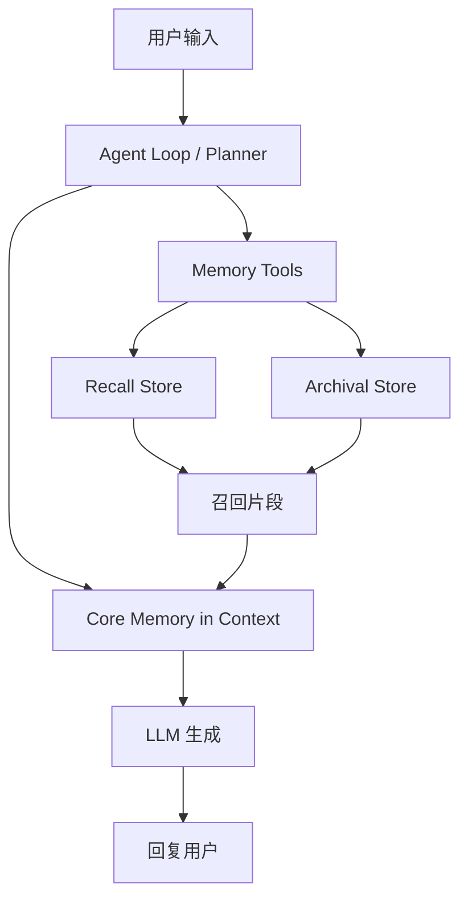
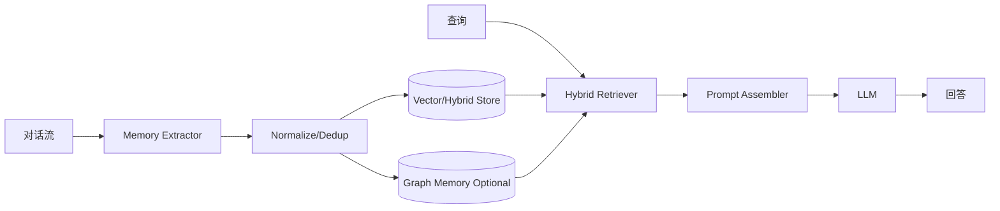
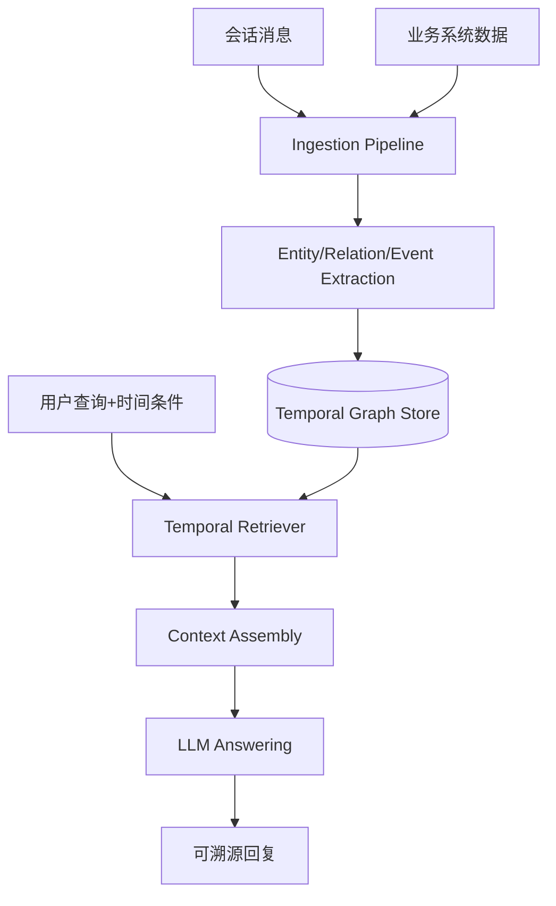
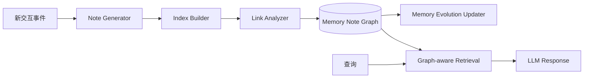
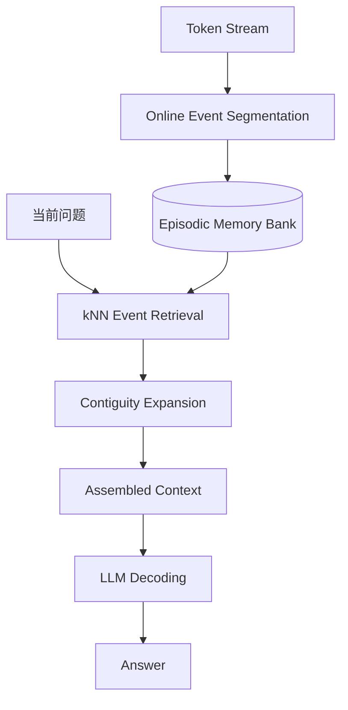
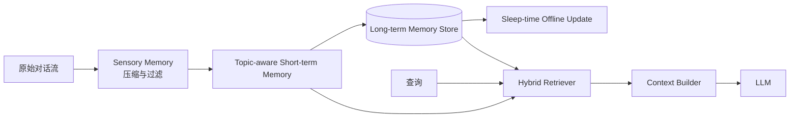

# AI Memory 最新开源框架调研报告（论文体例）

**作者**：AI Memory 架构调研代理  
**日期**：2026-04-28  
**版本**：v1.0  

---

## 摘要

随着 LLM Agent 从“单轮问答”走向“长期交互与持续学习”，Memory 系统已从简单的向量检索演化为多层级、时序化、图结构化、甚至具备“自我组织”能力的架构。本文系统调研 6 个具有代表性的最新开源 AI Memory 框架：**MemGPT/Letta、Mem0、Zep/Graphiti、A-MEM、EM-LLM、LightMem**。  
报告从论文核心方法、系统架构、工程实现、效果与成功经验、局限性进行逐项分析；并为每个框架提供可复用的“**memory 输入-生成-检索**”完整示例与架构图。最后给出下一代 AI Memory 的发展方向：分层混合记忆、时序/因果图记忆、写入治理与遗忘机制、评测标准化与可解释 memory ops。

**关键词**：LLM Agent、Long-term Memory、Graph Memory、Temporal KG、Agentic Memory、Memory-Augmented Generation

---

## 1. 引言

当前主流 LLM 面临三类记忆瓶颈：  
1) 上下文窗口有限，长期历史无法持续保真；  
2) 检索与生成割裂，导致“找得到但答不好”；  
3) 缺少生命周期管理（写入、更新、合并、遗忘、冲突解决）。

近年来开源社区出现两条主要路线：  
- **外部记忆系统路线**：将 memory 作为独立层（Mem0、Zep、A-MEM、LightMem）；  
- **模型内存机制路线**：改造推理时记忆组织方式（MemGPT、EM-LLM）。

本文目标是：给出可落地的框架对比与架构认知，而不是仅做指标摘录。

---

## 2. 调研范围与方法

### 2.1 纳入标准

- 有公开论文/技术报告；
- 有开源代码仓库（可复现或可工程使用）；
- 明确面向 Agent 长期记忆问题（非纯向量数据库）；
- 2023–2026 的代表性“新一代方案”。

### 2.2 评估维度

- 记忆分层（短期/长期/图谱/事件）；
- 写入机制（抽取、结构化、更新策略）；
- 检索机制（语义检索、时序检索、图检索、混合检索）；
- 成本与延迟设计；
- 工程成熟度与生态兼容性。

---

## 3. 框架逐项分析

---

## 3.1 MemGPT / Letta

### 3.1.1 论文与定位

MemGPT 提出“LLM 像操作系统一样管理分层内存”的思路：通过主上下文与外部存储分页，突破固定上下文窗口约束 [1]。随后该开源工程演进为 Letta 框架 [2][3]。

### 3.1.2 技术架构分析

- **核心思想**：Virtual Context Management（虚拟上下文管理）；  
- **层次结构**：  
  - In-context（核心工作记忆）；  
  - Out-of-context（召回存储 + 档案存储）；  
- **关键机制**：LLM 可通过工具调用执行 memory write/read（自编辑记忆）。



### 3.1.3 成功经验总结

- 把 memory 问题抽象成“上下文分页”，概念清晰，易迁移到多种 Agent；  
- memory 操作由 Agent 自主决策，提高适配性；  
- 在长对话和大文档任务中具备明显可扩展性 [1]。

### 3.1.4 完整示例（输入→生成→检索）

**输入（多轮）**
```text
User: 我对花生过敏，下次推荐餐厅时避开坚果。
User: 我每周三晚上去游泳。
```

**memory 生成（结构化）**
```json
{
  "core_memory_update": [
    {"type": "preference", "key": "allergy", "value": "peanut"},
    {"type": "routine", "key": "exercise", "value": "swimming_wed_night"}
  ],
  "archival_write": true
}
```

**检索请求**
```text
User: 帮我安排周三晚餐和运动计划。
```

**召回结果**
```json
[
  "allergy=peanut",
  "routine=swimming_wed_night"
]
```

**最终生成**
```text
建议你周三 18:00 吃无坚果高碳水餐，19:30 去游泳，避免含花生酱的菜品。
```

---

## 3.2 Mem0

### 3.2.1 论文与定位

Mem0 是“生产级 Agent 记忆层”，强调从会话中动态抽取、压缩与检索关键事实，关注准确率、时延和 token 成本的平衡 [4][5]。

### 3.2.2 技术架构分析

- **写入**：从对话中抽取 salient memories（关键记忆）；  
- **存储**：可接向量库/图记忆扩展（Mem0g）；  
- **检索**：语义 + 关键词 + 实体关联等多信号融合（新版本强调单次检索低延迟）；  
- **特点**：面向生产的多级 memory（用户、会话、Agent）。



### 3.2.3 成功经验总结

- 将“全量拼接历史”替换为“关键事实记忆”，显著降低成本；  
- 评测中在 LoCoMo 等任务显示较强效果与时延优势（论文给出相对提升）[4]；  
- API 设计接近中间件，利于业务系统落地。

### 3.2.4 完整示例（输入→生成→检索）

**输入**
```text
User: 我是自由职业设计师，偏好极简风，预算 8000 以内买笔记本。
```

**memory 生成**
```json
{
  "user_profile": {
    "job": "freelance_designer",
    "style_pref": "minimalist",
    "budget_laptop_cny": "<=8000"
  },
  "entities": ["职业", "审美偏好", "预算约束"]
}
```

**检索请求**
```text
User: 给我推荐 3 台适合我的笔记本。
```

**检索命中**
```json
{
  "must_constraints": ["budget<=8000"],
  "soft_constraints": ["minimalist_design", "design_workload"]
}
```

**生成结果**
```text
推荐 A/B/C 三款，均控制在 8000 内，并优先考虑屏幕色准与轻薄外观。
```

---

## 3.3 Zep / Graphiti

### 3.3.1 论文与定位

Zep 提出以 **Temporal Knowledge Graph（时序知识图）** 为核心的 Agent Memory 架构，开源引擎为 Graphiti [6][7]。其关键能力是“历史事实随时间变化仍可追溯”。

### 3.3.2 技术架构分析

- **摄入**：对话 + 业务结构化数据持续写入；  
- **建图**：实体、关系、事件节点带时间有效区间（bi-temporal 思想）；  
- **检索**：语义相关 + 图邻域 + 时间过滤联合；  
- **适用场景**：客服、CRM、企业 Copilot（事实会更新且需审计）。



### 3.3.3 成功经验总结

- 把“记忆冲突”转化为“时态有效性”问题，减少覆盖式更新带来的信息丢失；  
- 对多会话、多时间点推理任务更友好；  
- Graphiti 开源使“图记忆”从论文走向工程。

### 3.3.4 完整示例（输入→生成→检索）

**输入**
```text
2026-01: 用户公司总部在上海。
2026-03: 用户公司总部迁至深圳。
```

**memory 生成（时序图）**
```json
[
  {"entity":"CompanyX", "relation":"headquarter_in", "value":"Shanghai", "valid_to":"2026-03"},
  {"entity":"CompanyX", "relation":"headquarter_in", "value":"Shenzhen", "valid_from":"2026-03"}
]
```

**检索请求**
```text
User: 2026年2月他们总部在哪？
```

**检索命中**
```json
{"entity":"CompanyX","headquarter_in":"Shanghai","time":"2026-02"}
```

**生成结果**
```text
在 2026 年 2 月，该公司总部仍在上海（3 月后迁至深圳）。
```

---

## 3.4 A-MEM（Agentic Memory）

### 3.4.1 论文与定位

A-MEM 提出“Agentic Memory”：记忆不是静态 KV，而是可动态索引、链接、演化的笔记网络，借鉴 Zettelkasten 方法 [8]。

### 3.4.2 技术架构分析

- **写入单元**：把新经历转为结构化 note（描述、关键词、标签等）；  
- **链接机制**：与历史 note 自动建立语义关联；  
- **演化机制**：新记忆可触发旧记忆属性更新；  
- **价值**：适用于研究助手、代码助手等“知识网络逐步成长”的任务。



### 3.4.3 成功经验总结

- 相比“只存事实”，A-MEM 更强调“事实之间关系”；  
- 记忆演化机制缓解历史条目僵化；  
- 在多模型实验中显示稳定收益（论文报告）[8]。

### 3.4.4 完整示例（输入→生成→检索）

**输入**
```text
User: 我在做一个跨境电商推荐系统，重点是冷启动和多语言。
```

**memory 生成（note）**
```json
{
  "note_id":"N1024",
  "summary":"用户正在构建跨境电商推荐系统",
  "tags":["cold-start","multilingual","recsys"],
  "links":["N188(cross-border payment)","N233(feature engineering)"]
}
```

**检索请求**
```text
User: 下周我要做技术评审，帮我列风险点。
```

**检索命中**
```json
[
  "N1024: cold-start,multilingual",
  "N233: feature drift risks",
  "N188: region compliance"
]
```

**生成结果**
```text
建议重点评审三类风险：冷启动样本稀疏、多语言语义对齐误差、跨区域合规与支付链路稳定性。
```

---

## 3.5 EM-LLM（Episodic Memory LLM）

### 3.5.1 论文与定位

EM-LLM 将“人类情景记忆”思想引入 LLM 推理：先在线分段形成事件，再做两阶段检索（相似检索 + 邻近事件扩展），在超长上下文场景实现高效记忆访问 [9]。

### 3.5.2 技术架构分析

- **事件分割**：基于 surprise + 边界优化形成 episodic blocks；  
- **记忆组织**：按事件存储而非按固定 chunk；  
- **检索策略**：先找相似事件，再做时间连续性扩展；  
- **特点**：无需微调即可接入部分模型推理流程（按论文设定）。



### 3.5.3 成功经验总结

- 将“长上下文检索”从文本片段提升到事件单元，减少碎片化；  
- 在超长 token 级别检索上兼顾效果与计算；  
- 为“认知启发式记忆架构”提供实证路线。

### 3.5.4 完整示例（输入→生成→检索）

**输入（长日志）**
```text
Session1: 需求讨论...
Session2: 方案评审...
Session3: 故障复盘...
```

**memory 生成（事件化）**
```json
[
  {"event_id":"E1","topic":"requirement","time":"t1"},
  {"event_id":"E2","topic":"design_review","time":"t2"},
  {"event_id":"E3","topic":"incident_postmortem","time":"t3"}
]
```

**检索请求**
```text
User: 上次事故与哪次设计决策相关？
```

**检索命中**
```json
{
  "primary":"E3",
  "expanded_neighbors":["E2"]
}
```

**生成结果**
```text
事故复盘（E3）与设计评审中的缓存失效策略（E2）强相关，建议回滚该策略并补充压测。
```

---

## 3.6 LightMem

### 3.6.1 论文与定位

LightMem 是 ICLR 2026 方案，强调“高性能 + 低开销”的记忆增强生成：感知记忆过滤、主题短期整合、离线长期更新（sleep-time update）[10][11]。

### 3.6.2 技术架构分析

- **Sensory Memory**：轻量压缩过滤噪声；  
- **Short-term Topic Memory**：按主题聚合摘要；  
- **Long-term Memory**：离线更新，避免在线推理负担；  
- **检索**：支持 embedding / context / hybrid。



### 3.6.3 成功经验总结

- 把“更新成本”从在线阶段迁移到离线阶段，适合高并发服务；  
- 三阶段设计使“记住什么、何时更新”更可控；  
- 在 LoCoMo、LongMemEval 上报告了较优的成本-效果比 [10]。

### 3.6.4 完整示例（输入→生成→检索）

**输入**
```text
User: 我准备三个月后考 PMP，每周只能学习 6 小时，周末可加班。
```

**memory 生成**
```json
{
  "sensory_filtered": ["PMP in 3 months", "6h/week", "weekend available"],
  "topic_summary": "认证备考计划约束",
  "ltm_record_id": "LM-7781"
}
```

**检索请求**
```text
User: 给我下周学习计划。
```

**检索命中**
```json
{
  "constraints":["deadline=3months","weekly_hours=6","weekend_extra=true"],
  "strategy":"hybrid"
}
```

**生成结果**
```text
下周建议：工作日 4 次 x 1h（知识点学习），周末 2h（模拟题+错题复盘）。
```

---

## 4. 横向对比

| 框架 | 记忆范式 | 主要优势 | 潜在短板 | 适用场景 |
|---|---|---|---|---|
| MemGPT/Letta | 分层虚拟上下文 | 概念统一、Agent 自主 memory ops | 复杂任务下策略调优成本高 | 通用对话 Agent |
| Mem0 | 生产级关键事实记忆 | 准确率-时延-成本平衡好 | 复杂关系建模需图扩展 | 商业助手、客服 |
| Zep/Graphiti | 时序知识图 | 时间一致性与可追溯性强 | 图构建运维复杂度高 | 企业知识与 CRM |
| A-MEM | Agentic Note Network | 动态组织与演化能力强 | note 质量依赖抽取质量 | 研究/开发助手 |
| EM-LLM | 情景事件记忆 | 超长上下文处理能力强 | 与通用业务系统集成成本较高 | 长文档/长日志推理 |
| LightMem | 三阶段轻量记忆 | 在线成本低、可扩展 | 需离线更新流水线支持 | 高并发个性化应用 |

---

## 5. 成功实践共性（关键总结）

1. **记忆必须“结构化”**：纯聊天拼接不可持续。  
2. **检索必须“混合化”**：语义检索单独使用在时间/逻辑问题上会失真。  
3. **写入必须“有治理”**：去重、冲突处理、失效管理、可信来源标签必须内置。  
4. **生成必须“引用证据”**：回答中能回指 memory 来源，降低幻觉。  
5. **评估必须“任务化”**：仅看 recall@k 不够，需要端到端 QA 与长期交互指标。

---

## 6. 未来发展方向

### 6.1 记忆架构趋势

- **分层融合**：短期缓冲 + 长期事实库 + 时序图 + 程序性记忆并存；  
- **记忆编排器（Memory Orchestrator）**：根据任务动态选择写入/检索策略；  
- **因果化与可验证**：从“相关记忆”走向“因果记忆链”。

### 6.2 工程趋势

- **Memory as Infrastructure**：从 SDK 升级为组织级平台能力；  
- **可观测性增强**：memory hit、冲突率、过期率、幻觉关联度成为核心指标；  
- **数据治理一体化**：隐私、合规、删除权、审计日志纳入 memory 生命周期。

### 6.3 研究趋势

- **自动遗忘与压缩理论**（何时忘、忘多少、忘哪类）；  
- **跨模态记忆统一表示**（文本/图像/语音/行为日志）；  
- **在线学习与记忆写入协同**（memory update 与 policy improvement 闭环）。

---

## 7. 结论

AI Memory 正从“RAG 附属组件”升级为 Agent 的核心基础设施。  
若追求快速上线与稳定收益，可优先采用 **Mem0 类生产级记忆中间层思路**；  
若业务对时序事实和审计要求高，优先 **Zep/Graphiti**；  
若面向复杂知识网络与持续演化任务，可考虑 **A-MEM**；  
若场景是超长上下文高效处理，**EM-LLM / LightMem** 展现出更强潜力。  
下一阶段竞争焦点将从“能记住”转向“**记得准、用得对、可解释、可治理**”。

---

## 参考文献

[1] Packer, C., et al. **MemGPT: Towards LLMs as Operating Systems**. arXiv:2310.08560, 2024. https://arxiv.org/abs/2310.08560  
[2] Letta Team. **MemGPT is now part of Letta**. 2024. https://www.letta.com/blog/memgpt-and-letta  
[3] Letta (formerly MemGPT) Open Source Repository. https://github.com/letta-ai/letta  
[4] Chhikara, P., et al. **Mem0: Building Production-Ready AI Agents with Scalable Long-Term Memory**. arXiv:2504.19413, 2025. https://arxiv.org/abs/2504.19413  
[5] Mem0 Open Source Repository. https://github.com/mem0ai/mem0  
[6] Rasmussen, J., et al. **Zep: A Temporal Knowledge Graph Architecture for Agent Memory**. arXiv:2501.13956, 2025. https://arxiv.org/abs/2501.13956  
[7] Graphiti Open Source Repository. https://github.com/getzep/graphiti  
[8] Xu, W., et al. **A-MEM: Agentic Memory for LLM Agents**. arXiv:2502.12110, 2025. https://arxiv.org/abs/2502.12110  
[9] Fountas, Z., et al. **Human-inspired Episodic Memory for Infinite Context LLMs (EM-LLM)**. ICLR 2025. https://openreview.net/forum?id=BI2int5SAC  
[10] Fang, J., et al. **LightMem: Lightweight and Efficient Memory-Augmented Generation**. arXiv:2510.18866, ICLR 2026. https://arxiv.org/abs/2510.18866  
[11] LightMem Open Source Repository. https://github.com/zjunlp/LightMem  
[12] Wu, D., et al. **LongMemEval: Benchmarking Chat Assistants on Long-Term Interactive Memory**. ICLR 2025. https://arxiv.org/abs/2410.10813

