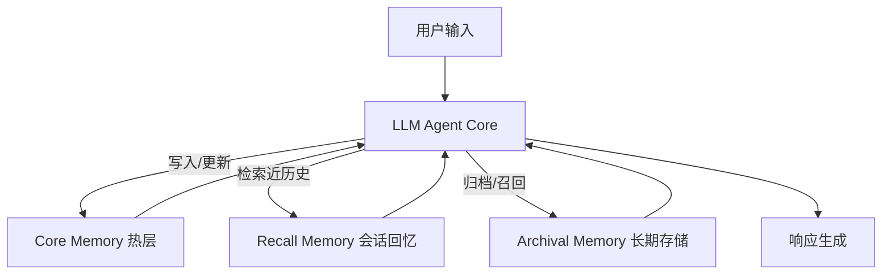
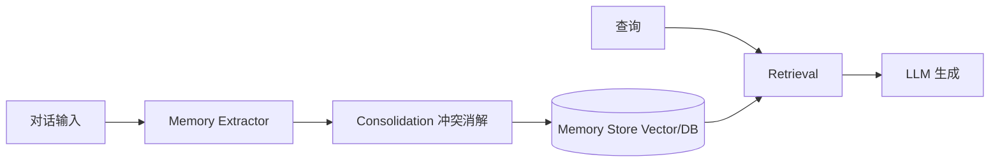
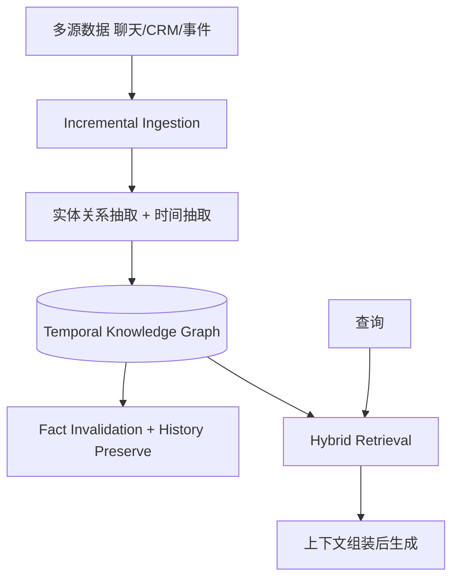
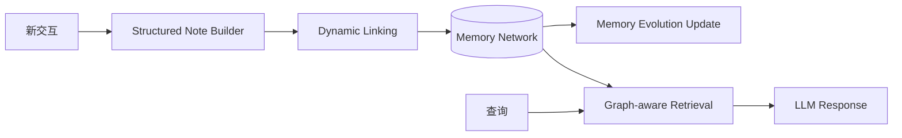
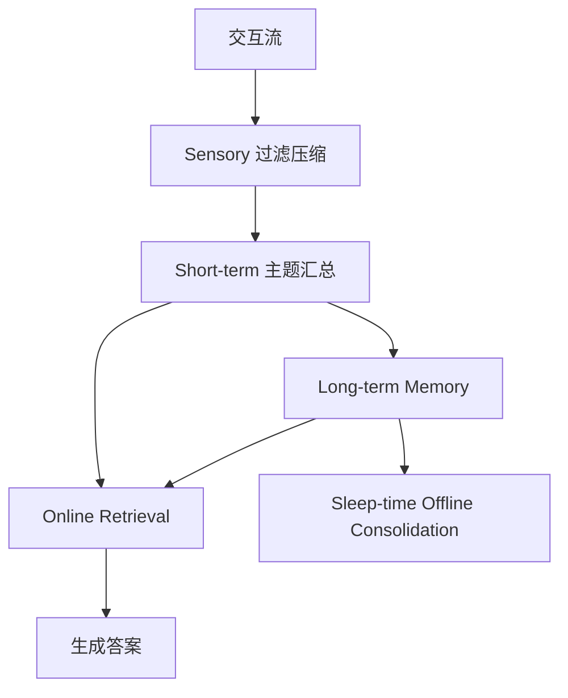

# 面向大模型智能体的长期记忆系统：开源框架技术架构、实证结果与未来方向综述（2023–2026）

## 摘要

随着 LLM Agent 从单轮问答走向持续交互与任务执行，记忆系统已成为核心基础设施。本文系统调研近期具有代表性的开源 AI Memory 框架：MemGPT/Letta、Mem0、Zep/Graphiti、A-MEM、LightMem。针对每个框架，本文给出论文级技术架构解析、关键实验与成功经验总结，并提供完整的“记忆输入-生成-检索”实例。本文进一步归纳当前主流路线：分层记忆、记忆中间层、时间知识图记忆、Agentic 动态记忆与轻量高效记忆。最后，围绕统一记忆策略学习、时间一致性、可验证记忆治理和成本-效果 Pareto 优化等方向，给出未来研究展望。结论表明，AI Memory 正从被动检索增强走向主动记忆管理，从静态文本块走向时间感知与结构化融合记忆。

**关键词**：LLM Agent；Long-term Memory；Agentic Memory；Temporal Knowledge Graph；Memory-Augmented Generation

---

## 1. 引言

传统 LLM 受限于上下文窗口，难以支持跨会话个性化、长期任务分解与持续演化知识。随着智能体在工程系统中的部署，记忆能力从“可选增强”演化为“系统刚需”：一方面要记住用户偏好、任务状态与历史决策；另一方面要在时间变化与事实冲突时进行更新、失效与追溯。

近期开源生态形成了多条技术路线：OS 风格分层记忆（MemGPT）、生产化记忆中间层（Mem0）、时间知识图记忆（Zep/Graphiti）、Agentic 动态记忆网络（A-MEM）与轻量高效记忆系统（LightMem）。本文目标是形成可直接用于学术汇报与工程决策的结构化综述。

---

## 2. 调研方法与对象

### 2.1 入选标准

1. 开源可用：具备 GitHub 代码与文档  
2. 学术可引：具备论文或技术报告  
3. 记忆闭环：支持写入、更新、检索  
4. 实证可比：具备任务评测或效率指标

### 2.2 入选框架

- F1: MemGPT / Letta  
- F2: Mem0  
- F3: Zep / Graphiti  
- F4: A-MEM  
- F5: LightMem

---

## 3. 框架逐一分析

## 3.1 MemGPT / Letta：分层记忆与 Agent 自主内存操作

### 3.1.1 技术架构

MemGPT 将上下文窗口视作有限主存，将外部存储视作扩展记忆，通过函数调用实现“写入、归档、召回、替换”。



### 3.1.2 成功经验

- 将“是否记忆、记什么、何时召回”交给 Agent，优于纯被动 RAG 拼接  
- 在长文档分析与多会话连续交互场景中显著改善上下文受限问题

### 3.1.3 完整示例：输入-生成-检索

**输入**

- t1: “我对花生过敏，早餐偏好燕麦。”
- t2: “下周给我制定三天早餐计划。”

**记忆生成（写入）**

```json
{
  "user_id": "u_001",
  "memory_write": [
    { "type": "profile", "key": "allergy", "value": "peanut" },
    { "type": "preference", "key": "breakfast", "value": "oatmeal" }
  ]
}
```

**检索**

```json
{
  "query": "三天早餐计划约束",
  "retrieved": ["allergy=peanut", "preference=oatmeal"]
}
```

**输出**：三天均生成无花生、以燕麦为主的早餐方案。

---

## 3.2 Mem0：生产化可扩展记忆中间层

### 3.2.1 技术架构

Mem0 将记忆能力抽象为可独立部署的 memory layer，核心流程为抽取、合并、存储、检索、注入生成。



### 3.2.2 成功经验

- 以平台化接口统一记忆读写，利于业务集成  
- 强调生产可用性与规模化部署能力

### 3.2.3 完整示例：输入-生成-检索

**输入**：“我叫 John，是后端工程师，主要用 Go 和 PostgreSQL。”

**记忆生成**

```json
{
  "user_id": "john",
  "memories": ["name=John", "role=backend engineer", "tech=Go", "tech=PostgreSQL"]
}
```

**检索请求**：“给我数据库性能优化学习路径。”

**检索注入**：role/tech 相关事实。

**输出**：面向 Go + PostgreSQL 的索引、执行计划、连接池优化路线。

---

## 3.3 Zep / Graphiti：时间知识图谱记忆

### 3.3.1 技术架构

Graphiti 构建时间感知知识图，支持事实有效期（valid_at/invalid_at）、来源追踪（provenance）与混合检索（语义 + BM25 + 图遍历）。



### 3.3.2 成功经验

- 支持“当前事实”和“历史事实”并存，适合企业动态数据  
- 在 DMR 与 LongMemEval 等评测上具备竞争性结果

### 3.3.3 完整示例：输入-生成-检索

**输入事件**

1. “Alice 在 2025-01 是 PM。”
2. “Alice 在 2025-06 晋升为 Director。”

**记忆生成**

```json
[
  {
    "edge": "Alice-role-PM",
    "valid_at": "2025-01-01",
    "invalid_at": "2025-06-01"
  },
  {
    "edge": "Alice-role-Director",
    "valid_at": "2025-06-01",
    "invalid_at": null
  }
]
```

**检索**

- 当前查询：Director  
- 2025-03 点查：PM

---

## 3.4 A-MEM：Agentic 动态索引与记忆演化

### 3.4.1 技术架构

A-MEM 采用 Zettelkasten 启发的记忆组织方式：新记忆生成结构化笔记并链接历史记忆，同时支持旧记忆语义演化。



### 3.4.2 成功经验

- 解决“只追加不演化”的记忆老化问题  
- 在多基础模型评测中相对基线有一致提升

### 3.4.3 完整示例：输入-生成-检索

**输入**

- t1: “讨厌红眼航班”
- t2: “预算敏感，优先低价”
- t3: “若便宜 30% 以上可接受红眼”

**记忆演化**

```json
{
  "update": "avoid_red_eye_unless_price_gap>=30%"
}
```

**检索与输出**：当价差达到 34% 时，系统可解释性推荐红眼航班并给出约束依据。

---

## 3.5 LightMem：轻量高效三阶段记忆

### 3.5.1 技术架构

LightMem 基于“感觉记忆-短时记忆-长时记忆”三阶段，在线快速过滤与主题归纳，离线 sleep-time 做深度整合。



### 3.5.2 成功经验

- 在准确率与成本之间取得较好平衡  
- token/API 调用显著下降，体现系统工程优化价值

### 3.5.3 完整示例：输入-生成-检索

**输入**：包含大量寒暄噪声的长对话日志。  
**记忆生成**：过滤噪声后保留主题约束（如运动频次、旧伤、训练偏好）。

**检索**

```json
{
  "query": "下月健身计划",
  "retrieved": ["每周3次", "膝盖旧伤", "偏好低冲击训练"]
}
```

**输出**：低冲击、分阶段的可执行计划。

---

## 4. 跨框架对比与成功模式

### 4.1 路线对比

| 框架 | 核心特征 | 主要优势 |
|---|---|---|
| MemGPT/Letta | 分层记忆 + Agent 自主读写 | 长上下文突破、记忆主动管理 |
| Mem0 | 记忆中间层（平台化 API） | 易工程集成、生产可用 |
| Zep/Graphiti | 时间知识图 + 混合检索 | 时间一致性、关系推理、可追溯 |
| A-MEM | 动态链接 + 记忆演化 | 自组织知识网络、持续修正 |
| LightMem | 三阶段轻量机制 + 离线整合 | 成本/时延/质量平衡 |

### 4.2 可复用成功经验

1. 记忆系统必须支持更新/失效，而非只追加  
2. 时间维度建模是企业级 Agent 的关键能力  
3. 主动记忆操作优于被动上下文拼接  
4. 检索应采用向量、关键词、结构关系的融合  
5. 成本与时延治理应内建于记忆架构

---

## 5. 未来方向

1. **统一记忆策略学习**：从规则走向可训练策略（读/写/更新/遗忘）  
2. **可验证记忆治理**：来源、时间戳、置信度、可撤销机制  
3. **多智能体共享记忆协议**：权限边界、冲突合并、审计追踪  
4. **隐私与安全**：PII 最小化、分层加密、合规删除  
5. **评测升级**：长期一致性、时间一致性、成本-质量联合指标  
6. **工作记忆与长期记忆统一调度**：围绕 token budget 的记忆编排器

---

## 6. 结论

AI Memory 已从“附加能力”升级为 Agent 系统的“控制平面”。开源框架整体趋势为：从被动检索增强走向主动记忆管理，从静态文本存储走向时间感知结构化记忆，从单点效果优化走向质量、时延、成本的系统级联合优化。该趋势将持续推动可长期运行、可解释、可治理的智能体应用落地。

---

## 参考文献

[1] Packer C., et al. **MemGPT: Towards LLMs as Operating Systems**. arXiv:2310.08560, 2024.  
[2] Letta Team. **Letta (formerly MemGPT)**. GitHub: `letta-ai/letta`.  
[3] Mem0 Team. **Mem0: Building Production-Ready AI Agents with Scalable Long-Term Memory**. arXiv:2504.19413, 2025.  
[4] Belyi M., et al. **Zep: A Temporal Knowledge Graph Architecture for Agent Memory**. arXiv:2501.13956, 2025.  
[5] Zep Team. **Graphiti: Temporal knowledge graph framework**. GitHub: `getzep/graphiti`.  
[6] Xu W., et al. **A-MEM: Agentic Memory for LLM Agents**. arXiv:2502.12110, 2025.  
[7] Fan Z., et al. **LightMem: Lightweight and Efficient Memory-Augmented Generation**. arXiv:2510.18866, 2025.  
[8] ZJUNLP. **LightMem open-source implementation**. GitHub: `zjunlp/LightMem`.

