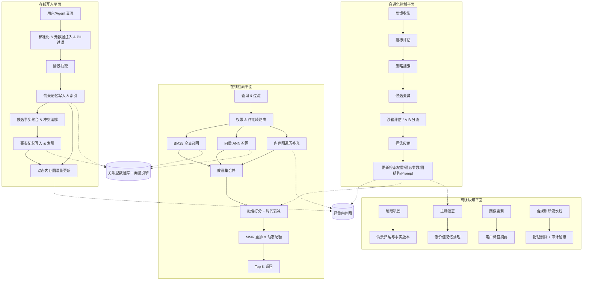
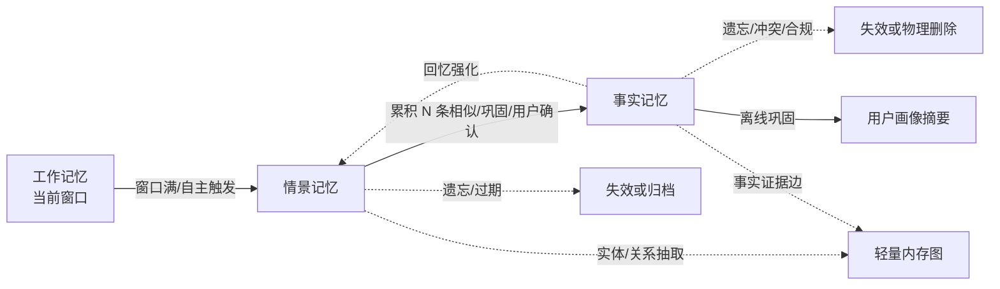
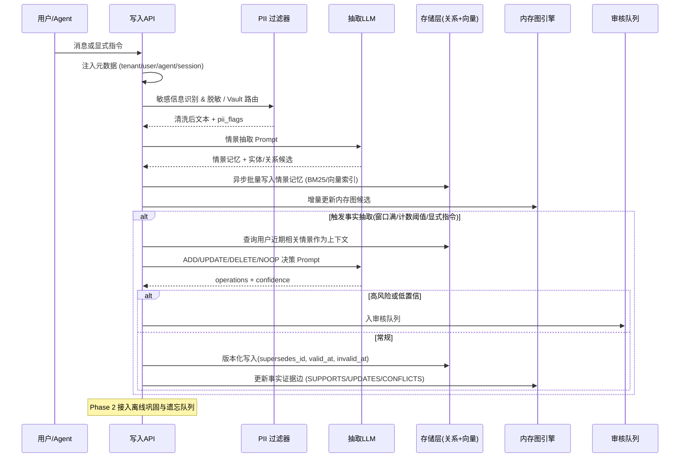
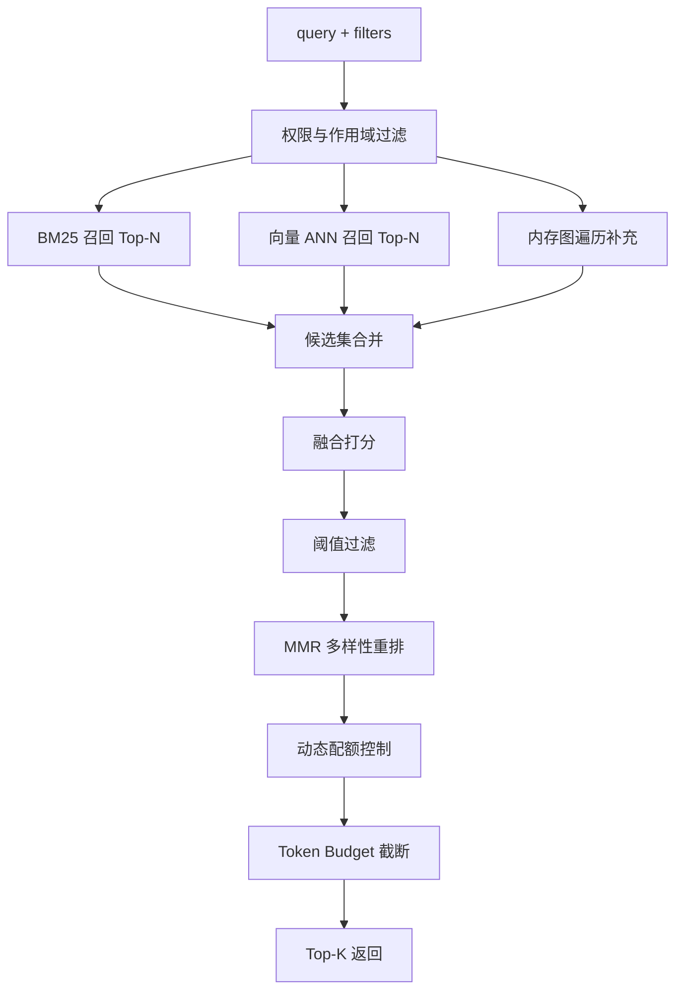
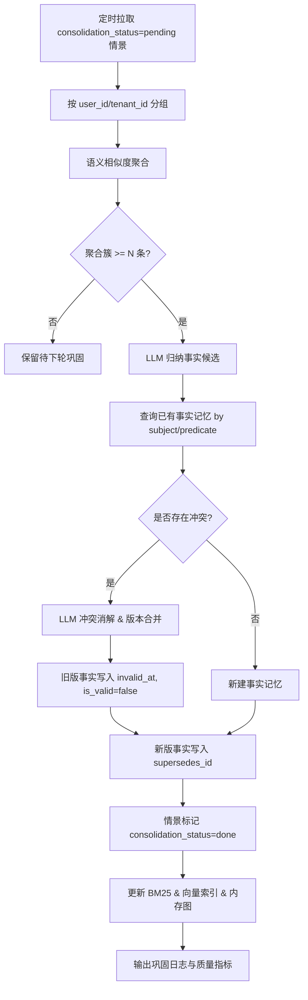
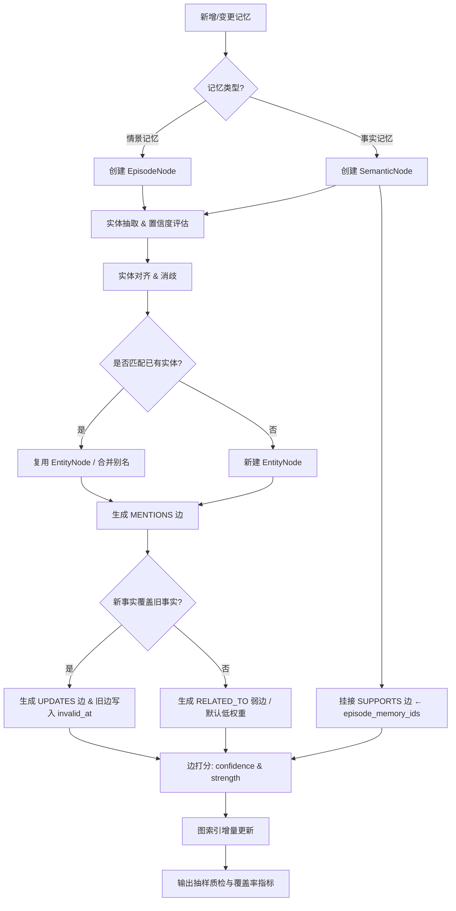
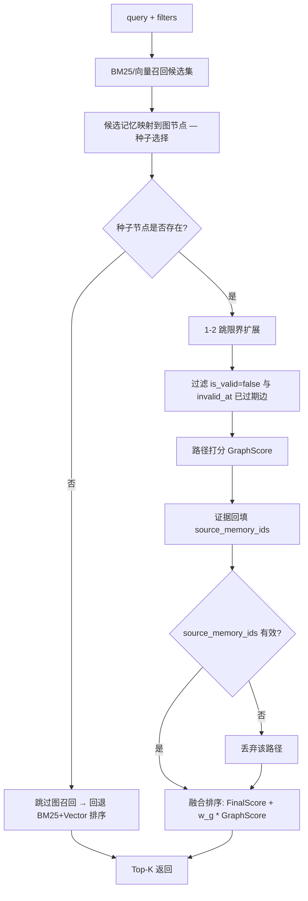
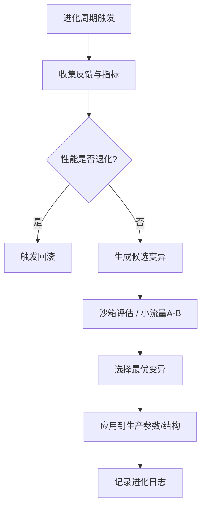

# Memory 系统方案设计 —— 自进化认知记忆架构

## 1. 文档目标

设计一套可落地、高性价比、兼具前沿性的 AI Memory 系统。整体方案使用三层记忆、混合检索、轻量内存图、离线巩固、可控遗忘和自进化控制等设计。

目标如下：

- 记忆按工作记忆、情景记忆、事实记忆三层管理，并引入完整记忆生命周期：抽取、巩固、强化、遗忘、冲突消解、合规删除。
- 检索采用 BM25 + 向量 + 时间感知的多路融合，辅以结构化字段过滤、多样性重排、动态配额与权限作用域过滤。
- 不依赖持久化图数据库，以关系型数据库 + 向量数据库 + 轻量内存图实现"结构化画像 + 语义记忆 + 动态关系推理"的混合存储；图作为可重建索引，而非事实源。
- 后续引入可控自进化能力：检索权重、遗忘参数、图结构、抽取 Prompt 等根据离线评估、灰度结果与回滚机制持续优化。
- 阶段性落地：Phase 1 快速可用，Phase 2 引入睡眠巩固与反馈闭环，Phase 3 演进至 Agentic Memory 与自进化认知架构。
- 在关键维度上对齐 Mem0、Zep/Graphiti、Letta/MemGPT、MIRIX、A-MEM、LightMem 等主流开源框架，并持续吸收 HippoRAG、MemoryBank、MemoRAG、Generative Agents 等代表性研究的成功经验[^mem0][^zep][^memgpt][^mirix][^amem][^lightmem][^hipporag][^memorybank][^memorag][^genagents]。

---

## 2. 设计理念与创新定位

### 2.1 主流开源框架的局限与本方案的针对性设计

| 框架名称 | 现有局限 | 对应设计 |
| :--- | :--- | :--- |
| Mem0 / Mem0g[^mem0] | 抽取-合并-检索流水线对遗忘曲线、时间衰减支持较弱；图变体 Mem0g 与主线分离 | 主线即内置艾宾浩斯遗忘[^ebbinghaus] + 主动修剪；轻量内存图与主线检索一体化 |
| Zep / Graphiti[^zep] | 双时间知识图谱依赖 PostgreSQL + 图引擎，运维与领域 schema 维护成本较高 | 关系库 + 向量库为事实源；图为可重建内存索引，无图数据库即可启动 |
| Memobase | 以结构化用户画像为主，对开放式语义事件覆盖不足 | 画像 + 情景 + 事实三态共存，兼顾结构化效率与语义泛化 |
| Letta / MemGPT[^memgpt] | 记忆操作由 LLM 通过函数调用自主决策，稳定性依赖 prompt 与工具质量；自编辑可能误覆盖 | "Agent 提议-审核"双轨，限制对事实源的直接覆盖；保留主上下文/外存分层思想 |
| A-MEM[^amem] | Zettelkasten 风格 agentic 演化带来不可预测性，缺少版本治理 | 保留笔记式抽取与链接演化，但配合事实版本号与冲突消解策略 |
| LightMem[^lightmem] | 感觉/短时/长时三阶段强调效率，跨会话治理与隐私机制不显式 | 借鉴在线快通道 + 离线 sleep-time 巩固；补全权限、版本、删除、审计 |
| MIRIX[^mirix] | 六类记忆 + 多 Agent 协调成本高，错误路由会导致召回失败 | 在三层记忆基础上保留反思、程序、资源类型作为可选扩展，由字段而非独立 Agent 承载 |
| 普遍问题 | 缺乏可评估的自优化能力 | 自进化控制引擎：参数/结构/Prompt 在离线评估集 + 灰度 + 回滚约束下持续迭代 |

### 2.2 与代表性研究的对接

| 方向 | 代表工作 | 本方案体现 |
| :--- | :--- | :--- |
| 时间感知与遗忘 | MemoryBank[^memorybank]、Zep 双时间事实[^zep] | 艾宾浩斯衰减 + 反馈强化 + bi-temporal `event_time / recorded_at` |
| 图结构记忆 | HippoRAG[^hipporag]、Mem0g[^mem0]、Zep[^zep] | 轻量内存图、证据子图、`SUPPORTS / UPDATES / CONFLICTS` 边语义 |
| 反思与策略记忆 | Reflexion[^reflexion]、Generative Agents[^genagents] | 失败/纠错经验作为反思类事实记忆，进入检索但不作为强事实 |
| Agentic Memory | A-MEM[^amem]、MemGPT[^memgpt] | Agent 自主提议 + 审核队列；隐式反馈强化 |
| 全局记忆增强检索 | MemoRAG[^memorag] | 向量召回前的会话级摘要可作为 query 改写输入 |
| 评测体系 | LoCoMo[^locomo]、LongMemEval[^longmemeval] | 离线评估集采用 LoCoMo / LongMemEval 任务结构作为基准模板 |

### 2.3 核心特色

1. **三层记忆 + 完整生命周期管理**：抽取、巩固、强化、遗忘、冲突消解、合规删除全链路闭环。
2. **混合检索 + 时间感知**：BM25 + 向量 + 内存图三路召回，融合时间衰减与重要性。
3. **仿生遗忘与睡眠巩固**：自适应遗忘曲线、离线巩固、价值修剪。
4. **多 Agent 原生可观测性**：字段化权限、来源、角色、会话与任务标识。
5. **内存驻留式轻量级记忆图谱**：避免一开始引入高运维图数据库，可由事实源随时重建。
6. **反馈驱动的自进化框架**：参数、结构、Prompt 在评估集 + 灰度 + 回滚约束下迭代。
7. **隐私治理内建**：PII 过滤、租户隔离、可见性作用域、被遗忘权与审计留痕。

### 2.4 产品对外形态

对外暴露统一的 Memory Service API，覆盖以下能力：

- **写入接口**：`ingest_message`、`propose_memory`（Agent 提议入审核队列）、`record_feedback`（点赞、纠错、删除）。
- **检索接口**：`retrieve(query, filters, scope, top_k)`，返回带来源与置信度的记忆条目。
- **管理接口**：`update_memory`、`invalidate_memory`、`hard_delete_memory`（合规删除）、`export_memory`（数据可导出）。
- **可观测接口**：`memory_panel`（用户可见的记忆面板）、`audit_log`（访问与变更审计）。
- **运行时形态**：可作为独立中间层服务供多 Agent 复用，也支持嵌入式 SDK；底层存储由关系库、向量引擎与可重建内存图构成。

### 2.5 总体架构



系统由**四个平面协同工作**：在线写入、在线检索、离线认知、自进化控制。**关系库与向量库是事实源，轻量内存图是可重建的关系索引**。

---

## 3. 三层记忆模型与数据定义

### 3.0 写入治理前置约束

为避免"错误写入后长期扩散"的问题，写入链路设置最小治理门禁：

- **PII 过滤前置**：默认对手机号、身份证、银行卡、地址、人名等敏感字段进行模式识别与脱敏；命中高敏感字段直接落入 `Knowledge Vault`（受限访问）而非常规事实源（参考 MIRIX 的隐私分层思想[^mirix]）。
- **双时间轴必填**：每条可持久化记忆必须同时记录 `event_time`（事实发生时间）与 `recorded_at`（系统知晓时间），用于回放、纠错与时序冲突判定（参考 Zep 的 bi-temporal 设计[^zep]）。
- **证据可追溯**：事实记忆必须携带 `episode_memory_ids`，缺失证据链的事实不得进入线上检索。
- **高风险更新需审核**：涉及健康、金融、权限、删除等高风险字段时，Agent 提议仅可进入审核队列，不可直接覆盖事实源。
- **删除分层**：默认逻辑失效（`is_valid=false`）+ 检索屏蔽；涉及合规删除请求（被遗忘权）时，再执行物理删除流水线与审计留痕。
- **租户/作用域隔离**：所有读写按 `tenant_id / user_id / agent_id / visibility_scope` 字段强制过滤，跨租户访问由权限网关显式授权。

### 3.1 模型转换



- **工作记忆（Working Memory）**：源自 Baddeley 与 Hitch 的多成分工作记忆模型[^baddeley]，在 LLM 系统中对应上下文窗口，不持久化。
- **情景记忆（Episodic Memory）**：源自 Tulving 的长时记忆分类[^tulving]，存储带时间、来源、情境的具体事件，是事实与图结构的证据底座。
- **事实记忆（Semantic Memory）**：同样源自 Tulving[^tulving]，表示去情境化的抽象知识、事实与偏好，长期有效且可复用。

> 说明：本方案将"反思类经验"（来自 Reflexion[^reflexion]）作为事实记忆的子类型 `event_type=reflection` 承载，避免增加额外存储平面；将"程序/技能"作为 `event_type=procedure`，将"资源/文件指针"作为 `event_type=resource`。这与 MIRIX 的六类记忆思想一致，但通过字段化降低运维复杂度。

### 3.2 工作记忆（Working Memory）

定义：当前对话窗口或最近几次交互的上下文。

- 容量受限于 LLM Context Window，访问速度极快，对话结束后可能压缩或丢弃。
- 作用：维持当前任务的连贯性，处理即时指代（如"它"、"刚才那个"）。

**当前最近 N 轮（默认 5 轮）已在上下文中处理，不进入持久化存储。**

### 3.3 情景记忆结构（EpisodeMemory）

```python
@dataclass
class EpisodeMemory:
    """
    单条 Episode / 事件记录，与上游 JSON 字段一一对应。
    时间字段在协议层为 ISO8601 字符串（如 2026-04-23T10:23:11Z）。
    """
    # ---------- 标识 ----------
    id: str                                 # ep_20260420_001
    tenant_id: str                          # 多租户隔离
    adiu: str                               # 设备/安装实例标识
    user_id: str
    session_id: str
    task_ids: list[str]                     # 关联子任务
    agent_id: str
    agent_role: str                         # researcher / support / ...

    # ---------- 内容 ----------
    text: str                               # 自然语言摘要或正文
    source: str                             # skill / sub_agent / 来源
    event_type: str                         # contact_change / reflection / procedure / resource / ...

    # ---------- 时间（双时间轴） ----------
    event_time: str                         # 事实发生时间 (ISO8601)
    recorded_at: str                        # 系统知晓时间 (ISO8601)
    time_scope: str | None = None           # 事件时段，如 "2026-04-20T08:00Z/2026-04-20T09:00Z"

    # ---------- 治理 ----------
    visibility_scope: str = "user_private"  # global / tenant / session / user_private
    is_valid: bool = True                   # 软删除/质检失败可置 False
    version: int = 1                        # 结构/业务版本
    pii_flags: list[str] = field(default_factory=list)  # 命中的敏感字段类型

    # ---------- 强度与生命周期 ----------
    importance: int = 3                     # 1-5 重要性，由抽取器/反馈给出
    strength: float = 1.0                   # 记忆强度 S(初值 1.0)，受强化/衰减影响
    recall_count: int = 0                   # 累计召回次数
    last_recalled_at: str | None = None
    is_promoted_to_semantic: bool = False
    consolidation_status: str = "pending"   # pending / done / failed

    # ---------- 关联 ----------
    context_window_id: str | None = None    # 所属上下文窗口
    entities: list[dict] = field(default_factory=list)
    relations: list[dict] = field(default_factory=list)
    extra_json: dict[str, Any] = field(default_factory=dict)
```

说明：

- `entities` 与 `relations` 保留动态构图所需的实体和关系线索，参考 Mem0 的记忆元数据[^mem0]与 HippoRAG 的实体抽取[^hipporag]。
- `tenant_id / user_id / agent_id / session_id / visibility_scope / pii_flags` 用于追溯来源与权限过滤，对应 MIRIX 强调的多租户、隐私分层[^mirix]。
- `strength` 与 `recall_count` 共同支撑艾宾浩斯遗忘曲线[^ebbinghaus]与回忆强化（参考 MemoryBank 的强化机制[^memorybank]）。
- `consolidation_status` 用于离线巩固队列。
- 已删除原有冗余字段 `recall_time`、`is_promoted_to_semantic`（合并表达）等；时间字段统一 ISO8601 字符串。

### 3.4 情景记忆抽取 Prompt 设计

复用 Mem0 七段式骨架（角色定义 → 类目 → Few-shot → 输出格式 → 补充规则 → 任务触发句）[^mem0]，但定位调整为"事件轨迹摘要"而非"用户画像"。

- **可复用项**：
  - 七段式骨架结构。
  - 空事件返回约定（`Hi.` → `{"episodes": []}`）。
  - 任务触发句衔接 user input 的结构。
  - 通用规则（日期注入、语言检测、空值返回）。

- **不可复用项**：
  - 类目需重写为"事件类型 × 时间 × 主体 × 客体"四元结构，而非偏好/画像七类。
  - 安全规则（"不要暴露 prompt"等消费者级防御）按企业内部部署需求重写。
  - Few-shot 示例需替换为业务真实对话。
  - 在首位与尾位分别强化"基于全部可见说话人提取事件，但需在 `source` 字段注明发起者"等核心约束（首因/近因效应[^murdock]）。

```
[① 角色定义]
You are an Episodic Event Extractor. Your job is to summarize a conversation
into atomic episodes that capture WHO did WHAT, WHEN, WHERE, and WHY,
preserving temporal and source provenance.

[② 抽取类目]
Each episode should fill at least one of:
1. State change of an entity (e.g., user, contact, route, plan)
2. Action taken by user or assistant (with outcome)
3. Observation about environment (weather, traffic, system event)
4. User intent / preference signal expressed in this turn

[③ Few-shot]
(业务化示例若干)

[④ Output schema]
{"episodes": [{"text": "...", "event_type": "...", "event_time": "...",
               "subject": "...", "object": "...", "source": "..."}]}

[⑤ 补充规则]
- Today's date is {datetime}.
- Detect input language and output episodes in the same language.
- Return {"episodes": []} if nothing event-like is observed.
- Each episode MUST include event_time; if uncertain, use recorded_at and mark estimated=true.
- Do NOT fabricate entities not present in the conversation.

[⑥ 任务触发句]
Following is a conversation. Extract episodes and return the JSON above.
```

### 3.5 事实记忆结构（SemanticMemory）

```python
@dataclass
class SemanticMemory:
    """
    事实记忆，长期偏好/画像/反思/程序类记忆片段（示例 id 前缀 lt_）。
    """
    # ---------- 标识 ----------
    id: str                                 # lt_20260420_003
    tenant_id: str
    adiu: str
    user_id: str
    session_ids: list[str]                  # 多会话复用同一条事实
    episode_memory_ids: list[str]           # 证据链：来源情景记忆 ID
    agent_id: str
    agent_role: str                         # reviewer / extractor / ...

    # ---------- 内容 ----------
    text: str
    fact_type: str                          # preference / profile / plan / reflection / procedure / resource
    subject: str | None = None              # 事实主体（实体ID或描述）
    predicate: str | None = None            # 事实谓词
    object_value: str | None = None         # 事实客体

    # ---------- 时间（双时间轴） ----------
    event_time: str                         # 事实发生/生效时间
    recorded_at: str                        # 系统知晓时间
    valid_at: str | None = None             # 当前版本生效时间
    invalid_at: str | None = None           # 当前版本失效时间（被新版本覆盖时填）

    # ---------- 治理 ----------
    visibility_scope: str = "user_private"  # global / tenant / session / user_private / vault
    is_valid: bool = True
    version: int = 1                        # 结构/业务版本
    supersedes_id: str | None = None        # 上一版本事实 id
    pii_flags: list[str] = field(default_factory=list)

    # ---------- 强度与生命周期 ----------
    importance: int = 3                     # 1-5 重要性
    strength: float = 1.0                   # 记忆强度 S
    reinforce_count: int = 0                # 强化（正反馈、重复确认）次数
    last_recalled_at: str | None = None
    pinned: bool = False                    # 用户置顶/Agent 置顶

    # ---------- 扩展 ----------
    extra_json: dict[str, Any] = field(default_factory=dict)
```

说明：

- 移除原方案中含义模糊的 `score` 字段，统一用 `strength` 表示记忆强度，`importance` 表示业务重要性，二者职责分离。
- `supersedes_id` + `valid_at / invalid_at` 实现事实版本链与双时间，参考 Zep 的 bi-temporal 事实失效[^zep]。
- `fact_type` 取代多平面，把反思/程序/资源等纳入字段化承载，覆盖 MIRIX 六类记忆中的关键类型[^mirix]。
- `episode_memory_ids` 是事实记忆的证据来源，也是图中 `SUPPORTS` 边的来源。

### 3.6 事实记忆抽取 Prompt 设计

参考 Mem0 抽取框架（角色 → 核心约束首位 → 类目 → Few-shot → 输出 → 核心约束尾位 → 任务触发）[^mem0]，但策略改为 **ADD / UPDATE / DELETE / NOOP** 四元决策（Mem0 实际即采用 ADD/UPDATE/DELETE/NOOP，此处明确补全 NOOP，避免"只 ADD"或"必须改"的误判）。

- **可复用**：
  - 七段式 Prompt 骨架；首尾"GENERATE FACTS BASED ON USER MESSAGES"等约束反复强化。
  - Few-shot 含反例（assistant 自述不进入事实）。

- **不可复用 / 必须改造**：
  - 抽取类目需重写为业务相关的 `preference / profile / plan / reflection / procedure / resource` 六个 `fact_type`，覆盖反思与程序类记忆。
  - 输出由"facts 列表"扩展为带操作动作的对象：`{"action": "ADD/UPDATE/DELETE/NOOP", "fact": {...}, "supersedes_id": "..."}`。
  - 必须强制 `episode_memory_ids` 字段，无证据链则该候选事实丢弃。
  - 高风险 `fact_type`（health/finance/permission）若动作为 `UPDATE/DELETE`，自动路由至审核队列而非直接生效。

```
[Output schema]
{
  "operations": [
    {
      "action": "ADD" | "UPDATE" | "DELETE" | "NOOP",
      "fact": {
        "text": "...",
        "fact_type": "preference|profile|plan|reflection|procedure|resource",
        "subject": "...",
        "predicate": "...",
        "object_value": "...",
        "event_time": "...",
        "episode_memory_ids": ["ep_..."]
      },
      "supersedes_id": "lt_... (UPDATE/DELETE 必填)",
      "confidence": 0.0
    }
  ]
}
```

---

## 4. 写入流程（Ingest）



关键说明：

- **异步批处理**：情景记忆写入采用消息队列异步落库，主链路只校验与转发，单条写入 P95 控制在 50ms 内（这是 Mem0 强调的生产级延迟目标的工程化映射[^mem0]）。
- **抽取 Prompt 设计**：运用首因/近因效应[^murdock]与 Few-shot 反例（参考 Mem0[^mem0]）。
- **冲突消解**：版本化 + LLM 决策，明确支持 ADD/UPDATE/DELETE/NOOP 四种动作，参考 Mem0 的合并策略[^mem0]并补全 NOOP，避免无新信息时强制写入。
- **Agent 自主提议**：通过 `propose_memory` 工具实现，借鉴 A-MEM 的 agentic 组织能力[^amem]与 MemGPT 的自主写入思想[^memgpt]，并通过审核机制限制对事实源的直接覆盖。
- **高风险熔断**：`fact_type ∈ {health, finance, permission}` 或 `confidence < τ_review` 自动入审核队列。

---

## 5. 检索流程（多路融合 + 时间感知）



### 5.1 融合打分公式

\[ \text{FinalScore}_i = w_v \cdot \text{VecSim}_i + w_k \cdot \text{BM25Norm}_i + w_t \cdot \text{TimeDecay}_i + w_{imp} \cdot \text{Imp}_i \]

- **BM25**：经典文本检索排序函数[^bm25]，仅对 `text` 字段全文评分，并按候选集 min-max 归一化到 \([0,1]\)。
- **向量相似度**：余弦相似度归一化到 \([0, 1]\)，由向量引擎（如 Qdrant、Milvus）提供 ANN 召回。
- **时间衰减**：采用艾宾浩斯遗忘曲线指数形式[^ebbinghaus][^memorybank]。
- **重要性因子**：\(\text{Imp}_i = \text{importance}_i / 5\)（importance 取值 1–5），与 `strength` 解耦：`importance` 反映业务/抽取器赋予的静态价值，`strength` 反映动态强化。
- **权重默认值**：起步 \(w_v=0.45,\ w_k=0.30,\ w_t=0.15,\ w_{imp}=0.10\)（总和为 1），后续由离线评估和自进化控制引擎调整[^mem0]。
- 若候选无 `pinned=true` 强制提升至首位（保留用户/Agent 显式置顶语义）。

### 5.2 记忆强度更新

每次有效回忆或显式正向反馈触发**单次增量**强化：

\[ S_i \leftarrow \min(S_{\max},\ S_i + \lambda_r) \]

每次显式负反馈或冲突消解触发衰减：

\[ S_i \leftarrow \max(S_{\min},\ S_i - \lambda_d) \]

时间衰减按以下形式：

\[ \text{TimeDecay}_i = \exp(-\Delta t / (\tau \cdot S_i)) \]

参数默认值（**起始值**，由 Phase 3 自进化引擎在评估集上调优）：

- 初始 \(S_i(0) = 1.0\)；\(S_{\min}=0.1,\ S_{\max}=5.0\)。
- \(\lambda_r = 0.3\)，\(\lambda_d = 0.5\)（负反馈强于正反馈，避免过拟合用户即时偏好）。
- \(\tau = 7\) 天（用户偏好类）；可按 `fact_type` 不同设置（如 `plan` 类衰减更快）。

> 与原方案差异：原 `S_i ← S_i + λ_r * reinforce_count` 会随计数累积发散，且每次回忆会重复加总；此处改为单次增量并加上下界裁剪，符合 MemoryBank 强化机制[^memorybank]。

### 5.3 多样性重排（MMR）

\[ \text{MMR}_i = \lambda_{mmr} \cdot \text{sim}(c_i, q) - (1-\lambda_{mmr}) \cdot \max_{j \in S} \text{sim}(c_i, c_j) \]

MMR 由 Carbonell 与 Goldstein 提出[^mmr]，用于去重和多样性增强，\(\lambda_{mmr}\) 默认取 0.7。

### 5.4 过滤与配额策略

- **阈值过滤**：默认 \(\theta = 0.55\)（常见 RAG 实践经验值，作为初值由评估集校准）；低于阈值的候选不进入最终输出。
- **动态配额**：按查询意图调整三类记忆比例。
  - 时间词（"昨天"、"刚才"）→ 情景配额 ↑；
  - 偏好词（"我喜欢"、"我习惯"）→ 事实配额 ↑；
  - 关系词（"和谁一起"、"在哪条路"）→ 内存图配额 ↑。
- **权限过滤**：按 `tenant_id / user_id / agent_id / visibility_scope / is_valid` 强过滤；`vault` 作用域需要显式授权。
- **Token Budget 截断**：在 MMR 重排后，按 token 预算截断（默认 2K tokens 用于 memory context），优先保留 `pinned`、`importance ≥ 4`、`recently_recalled` 的条目。

---

## 6. 离线认知平面（Phase 2）

### 6.1 睡眠巩固

设计来源：LightMem 的 sleep-time 离线整合[^lightmem]、Generative Agents 的反思机制[^genagents]、A-MEM 的记忆演化[^amem]。



目标：

- 减少重复情景。
- 沉淀稳定事实并产生反思类记忆（基于 Reflexion 思想[^reflexion]）。
- 降低后续检索上下文冗余。

### 6.2 主动遗忘

\[ \text{ForgetScore} = 0.7 \cdot (1 - \text{TimeDecay}) + 0.3 \cdot (1 - \text{Imp}_{\text{norm}}) \]

其中 \(\text{Imp}_{\text{norm}}\) 是包含 `importance`、`recall_count`、`reinforce_count`、`pinned`、`is_referenced_by_graph` 的归一化综合分（参考 MemoryBank 的强化-衰减机制[^memorybank]）。

处置策略：

- \(\text{ForgetScore} > 0.85\)：候选归档（`is_valid=false`，仅离线可访问）。
- \(\text{ForgetScore} > 0.95\) 且无引用：进入物理删除候选队列（按合规策略与保留期裁定）。
- 高分候选**不直接物理删除**，必须经过留存期 + 审计窗口。

### 6.3 反馈闭环

- **显式反馈**：用户点赞、纠错、删除、确认事实，直接更新 `strength`、`is_valid`、`importance`，参考 Mem0 与 Zep 的反馈接口[^mem0][^zep]。
- **隐式反馈**：答案被继续追问（弱负反馈）、未被纠错（弱正反馈）、被后续任务引用（强正反馈），参考 MemoRAG 的生成质量反馈思想[^memorag]。
- **强化对称性**：所有隐式反馈强度均小于显式反馈（系数 ≤ 0.3 \(\lambda_r\)），避免噪声放大。
- **离线评估前置**：所有反馈策略进入生产前需在 LoCoMo[^locomo]、LongMemEval[^longmemeval] 风格的内部评测集上做小流量验证。

### 6.4 Agent 自主提议

- Agent 可通过 `propose_memory` 提交候选记忆 + 置信度 + 证据链（借鉴 A-MEM[^amem]、MemGPT[^memgpt]）。
- 低置信（< τ_auto）或高风险 `fact_type` 候选进入审核队列，不直接写入事实源。
- 审核结合规则、LLM 校验与抽样人工质检；准确率目标通过内部评测集确认（基线建议 ≥ 90%，超过该阈值才允许进一步放开自主写入比例）。

### 6.5 合规删除流水线

被遗忘权（GDPR / 业务合规）触发时：

1. 解析待删除主体（`user_id` 或具体 `memory_id`）。
2. 关系库 + 向量库执行物理删除，向量索引同步剔除。
3. 内存图删除相关节点与边，重建受影响子图。
4. 审计日志记录请求来源、操作时间、影响范围、操作者签名。
5. 下游缓存（如 Recall LRU、KV Store）联动失效。

---

## 7. 自进化认知记忆架构（Phase 3）

### 7.1 设计目标

Phase 3 实现系统级自优化，覆盖检索权重、遗忘参数、图结构与抽取模板。该思想来自 AutoML 与进化算法[^automl][^evoalg]，以及 Agent 记忆领域对自主管理的探索[^amem][^memgpt]。

自进化**不是无约束自动修改**，而是：

- 有评估集（基于 LoCoMo[^locomo]、LongMemEval[^longmemeval] 的任务模板 + 业务私有评测集）；
- 有候选策略；
- 有沙箱评估；
- 有小流量 A/B；
- 有回滚机制与告警阈值。

### 7.2 动态内存图实现方案

动态内存图保留"双层图（实体层 + 记忆层）"的设计，并补充为四类节点、六类边和一套轻量索引接口。

#### 7.2.1 设计来源

- HippoRAG[^hipporag]：知识图谱 + Personalized PageRank 的多跳检索范式。
- Mem0g[^mem0]：与向量记忆并存的图记忆变体，强调实体关系增强。
- Zep / Graphiti[^zep]：双时间事实图谱、`valid_at / invalid_at` 与社区摘要。
- A-MEM[^amem]：Zettelkasten 风格的笔记式动态链接与记忆演化。

#### 7.2.2 图节点

| 节点 | 来源 | 用途 |
| :--- | :--- | :--- |
| `EpisodeNode` | 情景记忆 | 保留事件、时间、会话、来源，是证据链入口 |
| `SemanticNode` | 事实记忆 | 表示稳定事实、偏好、反思、计划、画像片段 |
| `EntityNode` | 实体抽取 | 表示人、项目、组织、地点、产品、偏好对象等 |
| `CommunityNode` | 离线聚类 | 表示稳定主题簇或长期关系社区（参考 Zep 社区摘要[^zep]） |

#### 7.2.3 图边

| 边类型 | 含义 | 主要来源 |
| :--- | :--- | :--- |
| `MENTIONS` | 情景/事实提及实体 | 实体抽取 |
| `SUPPORTS` | 情景支持某条事实 | `episode_memory_ids` |
| `CONFLICTS` | 两条事实或事件存在冲突 | 冲突消解 |
| `UPDATES` | 新事实更新旧事实 | 版本控制（`supersedes_id`） |
| `RELATED_TO` | 可解释弱关联 | 共现、相似度、规则 |
| `BELONGS_TO` | 节点归属社区 | 离线聚类 |

#### 7.2.4 数据结构

```python
@dataclass
class GraphNode:
    id: str
    node_type: str              # episode / semantic / entity / community
    label: str
    tenant_id: str
    user_id: str
    memory_id: str | None = None
    created_at: str | None = None
    updated_at: str | None = None
    is_valid: bool = True
    extra_json: dict = field(default_factory=dict)

@dataclass
class GraphEdge:
    id: str
    edge_type: str              # MENTIONS / SUPPORTS / CONFLICTS / UPDATES / RELATED_TO / BELONGS_TO
    source_node_id: str
    target_node_id: str
    confidence: float           # 抽取/对齐可信度 [0,1]
    strength: float             # 边强度，受访问/反馈调整 [0,1]
    source_memory_ids: list[str]
    valid_at: str | None = None
    invalid_at: str | None = None
    last_accessed_at: str | None = None
    is_valid: bool = True
    extra_json: dict = field(default_factory=dict)

@dataclass
class MemoryGraphIndex:
    tenant_id: str
    user_id: str
    nodes: dict[str, GraphNode]
    edges: dict[str, GraphEdge]
    adjacency: dict[str, list[str]]
    built_at: str
    version: int
```

字段约束：

- `source_memory_ids` 必须存在，否则该边不能进入线上检索上下文（强证据链要求）。
- `confidence` 表示抽取或对齐可信度。
- `strength` 表示边强度，可被召回强化和时间衰减调整。
- `valid_at / invalid_at` 表示关系有效期，支持事实演化与旧关系失效，对齐 Zep 的双时间设计[^zep]。

#### 7.2.5 构图流程



关键规则：

- 情景记忆优先生成 `EpisodeNode` 和 `MENTIONS` 边。
- 事实记忆优先生成 `SemanticNode` 和 `SUPPORTS` 边。
- 新事实覆盖旧事实时，新增 `UPDATES` 边，并将旧边设置 `invalid_at`。
- `RELATED_TO` 是弱边，默认低权重，不作为强事实依据。
- 检测到冲突（同 `subject + predicate` 不同 `object_value` 且时间重叠）时新增 `CONFLICTS` 边并触发消解。

#### 7.2.6 图检索流程



图路径打分采用轻量公式：

\[ \text{GraphScore} = \text{PathStrength} \cdot \text{EvidenceCoverage} \cdot \text{TimeValidity} / (1 + \text{hop\_count}) \]

其中：

- `PathStrength`：路径边 `strength` 的几何平均（避免少数高强度边掩盖断链）。
- `EvidenceCoverage`：路径上具备可回填 `source_memory_ids` 的边占比，要求 ≥ 0.6。
- `TimeValidity`：在 `valid_at ≤ query_time ≤ invalid_at` 内的边占比。
- `hop_count`：多跳扩展深度，控制噪声（默认上限 2）。

> 该思路与 HippoRAG 的 PPR 在图上扩散[^hipporag]、Zep 的图遍历检索[^zep] 一致，但更轻量，适合内存图。

#### 7.2.7 图维护策略

| 操作 | 触发 | 处理 |
| :--- | :--- | :--- |
| 边强化 | 图路径被答案使用 | 提升 `strength`（受 \(S_{\max}\) 上界） |
| 边衰减 | 长期未访问或低置信 | 降低 `strength`（受 \(S_{\min}\) 下界） |
| 边失效 | 新事实更新旧事实 | 写入 `invalid_at` |
| 实体合并 | 高置信别名或重复实体 | 合并节点并保留 `alias_of` 映射 |
| 社区摘要 | 稳定主题簇形成 | 生成 `CommunityNode`（参考 Zep 社区摘要[^zep]） |
| 图修剪 | 低强度、无证据、长期未访问 | 进入候选删除或冷区 |
| 图重建 | 节点/边数量超阈值或一致性校验失败 | 从关系库 + 向量库全量重建 |

### 7.3 自进化控制引擎



进化维度：

- **检索权重**：贝叶斯优化或网格搜索，在离线评估集（LoCoMo[^locomo] / LongMemEval[^longmemeval] / 业务私有集）上调整 \(w_v, w_k, w_t, w_{imp}\)。
- **遗忘参数**：A/B 测试优化 \(\lambda_r, \lambda_d, \tau, \theta\)。
- **图结构演化**：调整边增删、`strength` 衰减率、剪枝阈值，受进化算法启发[^evoalg]。
- **抽取 Prompt 优化**：引入 DSPy[^dspy] 等框架，基于反馈样本搜索更优抽取模板（仅在离线评估集上迭代，胜出后才进入灰度）。

进化护栏：

- **评估指标多维度**：召回率、答案正确率、token 成本、P95 延迟、错误回忆率，任一维度退化超过阈值即回滚。
- **回滚机制**：所有变更写入版本化配置，最近 N 个版本可一键回滚。
- **告警阈值**：业务关键指标（如 `wrong_forget_appeal_rate`）超阈值触发自动暂停进化。

### 7.4 与代表性工作的对接

| 代表工作 | 本方案体现 | 边界 |
| :--- | :--- | :--- |
| HippoRAG[^hipporag] | 图遍历种子扩散、多跳事实整合 | 不引入完整 PPR 全图扩散，仅做限界扩展 |
| Mem0 / Mem0g[^mem0] | 抽取 Prompt 七段式骨架、ADD/UPDATE/DELETE/NOOP 决策 | 抽取类目按业务重写，引入证据链强约束 |
| Zep / Graphiti[^zep] | 双时间事实、社区摘要、混合检索 | 不依赖图数据库，图为可重建内存索引 |
| A-MEM[^amem] | 笔记式抽取、动态链接、记忆演化 | 必须审核，不直接落事实源；保留版本号 |
| LightMem[^lightmem] | 在线快通道 + 离线 sleep-time 巩固 | 补全权限、版本、合规删除 |
| MIRIX[^mirix] | 反思/程序/资源类型字段化承载 | 不拆为多 Agent，由统一服务承载 |
| MemoryBank[^memorybank] | 艾宾浩斯遗忘曲线、强化机制 | 参数受自进化引擎调优 |
| Reflexion / Generative Agents[^reflexion][^genagents] | 反思类事实记忆 | 反思仅作软证据，不覆盖原始事实 |
| DSPy[^dspy] | 抽取 Prompt 搜索 | 仅在离线评估集上迭代 |

### 7.5 端到端示例：通勤偏好与动态路况关联（图）

**场景背景**：用户 `user001` 在工作日早晚高峰有固定的通勤习惯，且对特定路段的拥堵情况敏感。系统需要通过图谱将"用户偏好"、"常去地点"与"实时路况事件"关联起来。

#### 1) Memory 输入与抽取

- **情景 1（T1 - 周一早高峰）**：用户在导航中说："还是走机场高速吧，虽然远点但比较稳。"
  - `EpisodeNode (ep_001)`：text="选择机场高速通勤", event_time=2026-04-27T08:30Z, session_id=sess_commute_001
  - `EntityNode`：`ent_user(user001)`、`ent_route_airport(机场高速)`、`ent_home(家)`、`ent_office(公司)`
- **情景 2（T2 - 周二早高峰）**：用户："今天中河高架好像堵死了，帮我切回机场高速。"
  - `EpisodeNode (ep_002)`：text="因拥堵切换至机场高速", event_time=2026-04-28T08:35Z
  - `EntityNode`：`ent_route_zhonghe(中河高架)`
- **事实巩固（T3 - 离线睡眠）**：
  - `SemanticNode (lt_001)`：fact_type=preference, text="user001 早高峰通勤偏好：优先选择机场高速，厌恶中河高架拥堵", episode_memory_ids=[ep_001, ep_002]

#### 2) 图结构生成与增量更新

- **MENTIONS 边**：`ep_001 → ent_route_airport`，`ep_002 → ent_route_zhonghe`，`ep_002 → ent_route_airport`。
- **SUPPORTS 边**：`ep_001 → lt_001`，`ep_002 → lt_001`。
- **RELATED_TO 边**：`ent_home ↔ ent_office (Commute)`，`ent_route_airport ↔ ent_home (Alternative)`。

#### 3) 图增强检索流程

- 用户查询："明天早上怎么去公司？"
- 检索步骤：
  1. **种子选择**：向量召回识别出 `ent_user`、`ent_office`、时间锚 `tomorrow_morning`。
  2. **限界扩展**：`ent_user → lt_001 → ep_001/ep_002 → ent_route_airport`。
  3. **GraphScore**：路径在早高峰多次强化，`PathStrength` 高、`EvidenceCoverage=1.0`、`TimeValidity=1.0`。
  4. **融合排序**：`w_g · GraphScore` 显著提升机场高速方案权重。
  5. **返回结果**：首选机场高速（备注："根据您的历史偏好，此路线早高峰更稳定"），备选中河高架（备注："历史显示该路段早高峰拥堵概率较高"）。

### 7.6 端到端示例：避堵策略的动态优化（自进化）

**场景背景**：系统发现用户在"雨天"或"突发事故"场景下，对系统推荐的"最短时间"路线满意度下降，用户更倾向"最稳妥"路线。

#### 1) 反馈收集与指标监控

- **隐式反馈**：雨天用户多次拒绝"最快路线"（含易积水小路），手动选择"主干道"。
- **显式反馈**：用户对"推荐路线"点击"不实用"或语音"太绕了 / 太险了"。
- **指标**：`wrong_forget_appeal_rate` 在天气=雨场景上升；`topk_ctr` 在极端天气子场景下降 10%。
- **触发**：性能退化触发 `score_calibration_job`。

#### 2) 进化策略生成与变异

- **问题**：当前权重未充分捕捉"天气"环境因子；`τ` 导致雨天偏好在非雨天被过度衰减。
- **候选变异**：
  1. 引入环境因子权重 `w_env`：检测到雨天时动态提升 `w_env=0.3`，相应降低 `w_v=0.25`。
  2. 针对 `event_type="weather_preference"` 的记忆，将 `λ_r` 从 0.3 提升至 0.5，少数反馈即可形成强记忆。
  3. 用 DSPy[^dspy] 重构情景抽取 Prompt，增加"环境上下文"（天气、路况、车辆类型）抽取要求。

#### 3) 沙箱评估与灰度发布

- **沙箱**：500 条雨天导航历史评测集，新策略使"雨天路线采纳率"提升 12%。
- **A/B**：杭州 5% 流量灰度 24 小时，`negative_feedback_rate` 下降 2.5%。
- **择优应用**：全量推送，写入进化日志 `Evolution_Log_20260428_002`。

#### 4) 优化后的检索表现

- 用户查询（雨天）："去西湖银泰。"
- 优化前：仅按"最短时间"推荐含支路小径，被用户拒绝。
- 优化后：
  1. **环境感知**：识别雨天，激活 `w_env`。
  2. **记忆强化**：检索到 `lt_002`（用户曾雨天拒绝类似支路），因 `λ_r` 提升保持高强度。
  3. **图关联**：图谱中"西湖银泰"周边支路在雨天被标记"高风险"。
  4. **返回**：直接推荐主干道方案（如延安路），备注："雨天路滑，已为您避开易积水支路，预计多花 3 分钟但更稳妥"。

---

## 8. 评测体系（贯穿所有 Phase）

| 评测维度 | 指标 | 参考 |
| :--- | :--- | :--- |
| 写入质量 | 抽取准确率、PII 漏报率、证据链完整度 | LongMemEval 信息抽取[^longmemeval] |
| 检索质量 | Recall@K、nDCG@K、错误回忆率 | LoCoMo QA[^locomo]、LongMemEval 多会话推理[^longmemeval] |
| 时间一致性 | 双时间事实正确率、历史时点查询正确率 | Zep[^zep]、LongMemEval 时间推理[^longmemeval] |
| 知识更新 | 冲突消解准确率、版本切换正确率 | LongMemEval 知识更新[^longmemeval] |
| 拒答能力 | 不可答正确率、过度回忆率 | LongMemEval 拒答[^longmemeval] |
| 使用质量 | LLM-as-a-Judge 答案质量、用户满意度 | Mem0 LoCoMo 评测[^mem0] |
| 成本 | P95 延迟、token 成本、存储增长 | Mem0[^mem0]、LightMem[^lightmem] |
| 安全治理 | 隐私泄露率、合规删除完成率、越权召回率 | MIRIX[^mirix] |

---

## 9. 对比开源框架的优越性总结

| 维度 | Mem0[^mem0] | Zep[^zep] | Memobase | Letta/MemGPT[^memgpt] | A-MEM[^amem] | LightMem[^lightmem] | MIRIX[^mirix] | 本方案 |
| :--- | :--- | :--- | :--- | :--- | :--- | :--- | :--- | :--- |
| 存储 | 向量 + KV + 可选图 | 时序图 + PG | 结构化 SQL | 多种后端 | 笔记网络 + 向量 | 三阶段缓存 + LTM | 多类型分仓 | 关系型 + 向量 + 轻量内存图 |
| 遗忘 | 弱 | 边失效 | 弱 | 弱 | 演化更新 | 离线整合 | 弱 | 艾宾浩斯 + 主动修剪 + 边衰减 + 合规删除 |
| 检索 | 语义 + 可选图 | 三层子图混合 | 字段匹配 | 多路并行 | 图感知检索 | 在线快通道 | 多类型分发 | BM25 + 向量 + 图 + 时间 |
| 自主性 | 被动 API | 被动 | 被动 | 高自主但风险 | 高自主 | 中等 | 多 Agent | 提议-审核 + 可控演化 |
| 自进化 | 弱 | 弱 | 弱 | 弱 | 演化但不评估 | 弱 | 弱 | 参数-结构-Prompt 评估闭环 |
| 隐私治理 | 一般 | 一般 | 一般 | 弱 | 弱 | 弱 | 强 | PII + Vault + 租户 + 合规删除 |
| 运维 | 低 | 高 | 低 | 中高 | 中 | 低 | 高 | 中低，渐进复杂度 |
| 多 Agent | 受限 | 有限 | 同步 | 绑定运行时 | 单 Agent 自管理 | 单 Agent | 多 Agent | 字段化可见性 |

---

## 10. 结论

本设计以分层记忆、混合检索、完整生命周期、自主治理为基础，以零持久化图数据库的工程哲学实现可演进的 AI Memory 架构，按以下三个 Phase 渐进迭代：

- **Phase 1**：保证三层记忆与 BM25 + 向量检索快速可用，引入 PII 过滤、双时间轴、版本控制、主动遗忘。
- **Phase 2**：引入睡眠巩固、反馈闭环、合规删除、离线评测。
- **Phase 3**：通过轻量内存图与自进化控制引擎增强跨 Session 串联、事实演化、关系推理与证据链解释能力，构建**端到端反馈机制**。

整体目标是在 Mem0[^mem0]、Zep[^zep]、A-MEM[^amem]、LightMem[^lightmem]、MIRIX[^mirix] 等代表性工作的基础上，做到"**记得准、用得对、忘得掉、管得住、可进化**"。

---

## 11. 参考文献

[^mem0]: Chhikara, P., et al. *Mem0: Building Production-Ready AI Agents with Scalable Long-Term Memory*. arXiv:2504.19413, 2025. <https://arxiv.org/abs/2504.19413>

[^zep]: Belyi, M., et al. *Zep: A Temporal Knowledge Graph Architecture for Agent Memory*. arXiv:2501.13956, 2025. <https://arxiv.org/abs/2501.13956>

[^memgpt]: Packer, C., et al. *MemGPT: Towards LLMs as Operating Systems*. arXiv:2310.08560, 2023. <https://arxiv.org/abs/2310.08560>

[^amem]: Xu, W., et al. *A-MEM: Agentic Memory for LLM Agents*. NeurIPS 2025 / arXiv:2502.12110. <https://arxiv.org/abs/2502.12110>

[^lightmem]: Fan, Z., et al. *LightMem: Lightweight and Efficient Memory-Augmented Generation*. arXiv:2510.18866, 2025. <https://arxiv.org/abs/2510.18866>

[^mirix]: Wang, Y., and Chen, X. *MIRIX: Multi-Agent Memory System for LLM-Based Agents*. arXiv:2507.07957, 2025. <https://arxiv.org/abs/2507.07957>

[^memorybank]: Zhong, W., et al. *MemoryBank: Enhancing Large Language Models with Long-Term Memory*. AAAI 2024 / arXiv:2305.10250. <https://arxiv.org/abs/2305.10250>

[^hipporag]: Gutiérrez, B. J., et al. *HippoRAG: Neurobiologically Inspired Long-Term Memory for Large Language Models*. NeurIPS 2024 / arXiv:2405.14831. <https://arxiv.org/abs/2405.14831>

[^memorag]: Qian, H., et al. *MemoRAG: Boosting Long Context Processing with Global Memory-Enhanced Retrieval Augmentation*. WWW 2025 / arXiv:2409.05591. <https://arxiv.org/abs/2409.05591>

[^reflexion]: Shinn, N., et al. *Reflexion: Language Agents with Verbal Reinforcement Learning*. arXiv:2303.11366, 2023. <https://arxiv.org/abs/2303.11366>

[^genagents]: Park, J. S., et al. *Generative Agents: Interactive Simulacra of Human Behavior*. arXiv:2304.03442, 2023. <https://arxiv.org/abs/2304.03442>

[^locomo]: Maharana, A., et al. *Evaluating Very Long-Term Conversational Memory of LLM Agents*. ACL 2024 / arXiv:2402.17753. <https://arxiv.org/abs/2402.17753>

[^longmemeval]: Wu, D., et al. *LongMemEval: Benchmarking Chat Assistants on Long-Term Interactive Memory*. ICLR 2025 / arXiv:2410.10813. <https://arxiv.org/abs/2410.10813>

[^ebbinghaus]: Ebbinghaus, H. *Memory: A Contribution to Experimental Psychology*. 1885.

[^baddeley]: Baddeley, A. D., and Hitch, G. *Working memory*. Psychology of Learning and Motivation, 8, 47–89, 1974.

[^tulving]: Tulving, E. *Episodic and semantic memory*. In Tulving, E., and Donaldson, W. (Eds.), Organization of Memory, 1972.

[^murdock]: Murdock, B. B. *The serial position effect of free recall*. Journal of Experimental Psychology, 64(5), 482–488, 1962.

[^bm25]: Robertson, S. E., and Zaragoza, H. *The Probabilistic Relevance Framework: BM25 and Beyond*. Foundations and Trends in Information Retrieval, 2009.

[^mmr]: Carbonell, J., and Goldstein, J. *The use of MMR, diversity-based reranking for reordering documents and producing summaries*. SIGIR 1998.

[^dspy]: Khattab, O., et al. *DSPy: Compiling Declarative Language Model Calls into Self-Improving Pipelines*. arXiv:2310.03714, 2023. <https://arxiv.org/abs/2310.03714>

[^automl]: Hutter, F., Kotthoff, L., and Vanschoren, J. (Eds.). *Automated Machine Learning: Methods, Systems, Challenges*. Springer, 2019.

[^evoalg]: Bäck, T. *Evolutionary Algorithms in Theory and Practice*. Oxford University Press, 1996.
