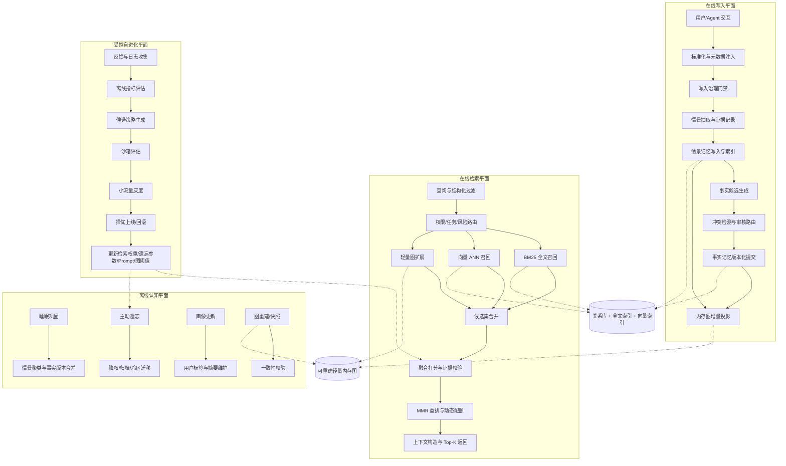
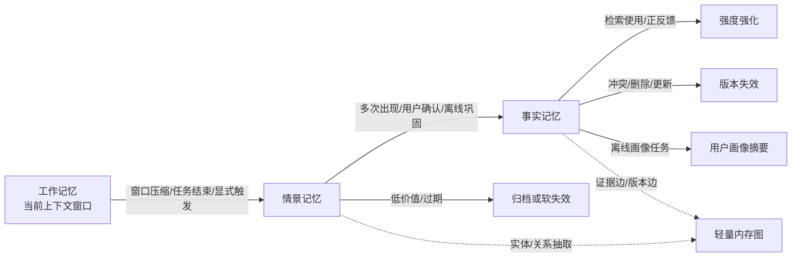
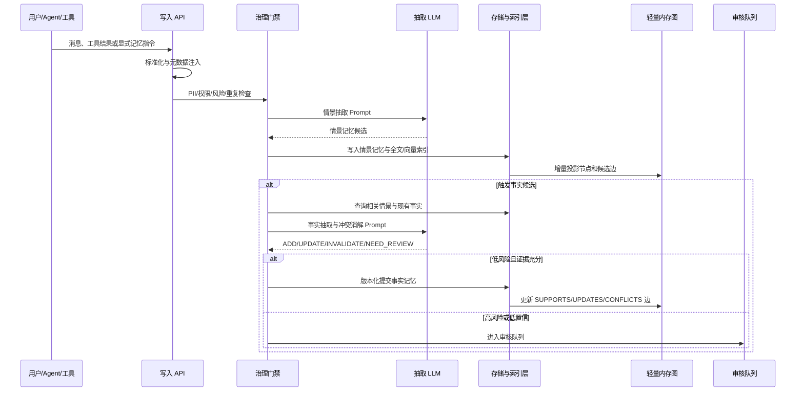
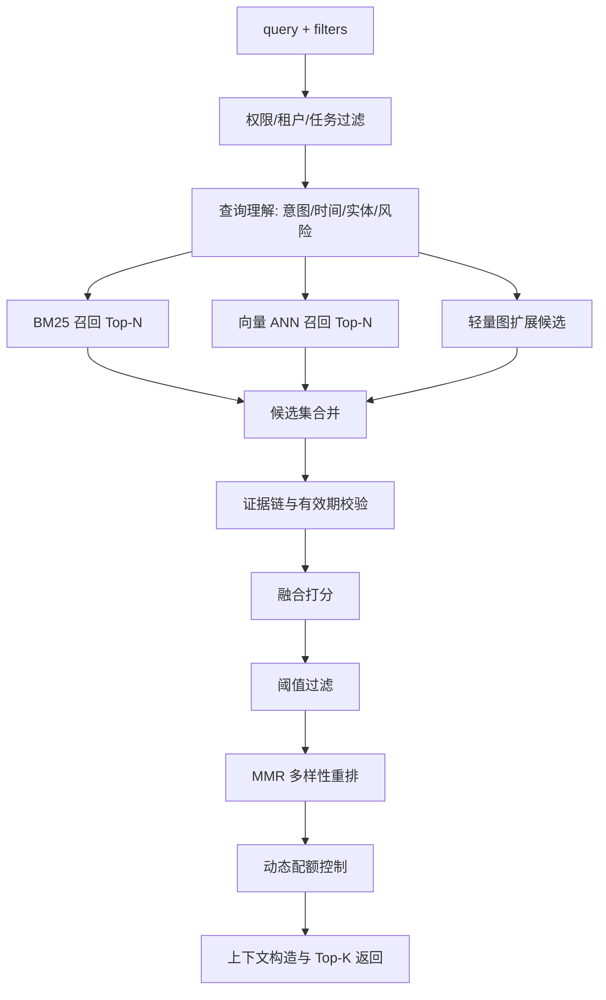
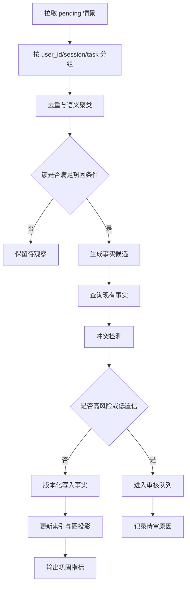
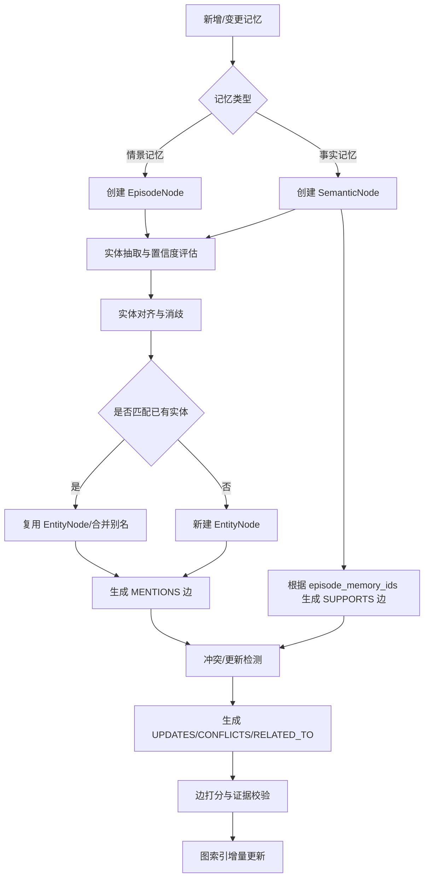
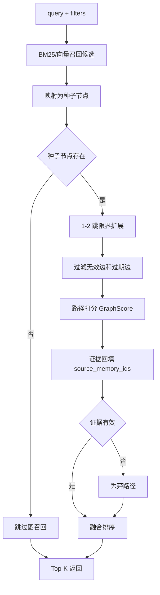
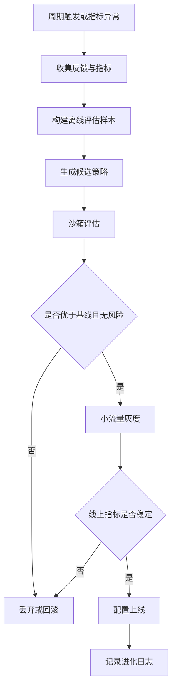

# 第二节：Memory 系统方案设计 —— 可治理的自进化认知记忆架构

## 1. 文档目标

本文在 `docs/chapter12/01_ai_memory_survey.md` 与 `docs/ai_memory_report.md` 的调研基础上，优化原有 Memory 系统方案，目标是设计一套**可落地、高性价比、可评估、可治理，并能逐步演进到 Agentic Memory 的 AI Memory 架构**。

本方案坚持三个原则：

1. **先保证正确性与治理，再追求自进化**：记忆系统的核心风险不是“记得不够多”，而是错记、过度记忆、冲突扩散和无法删除。
2. **长期事实必须有证据链**：事实记忆不得脱离情景来源单独存在，所有长期事实都应能追溯到会话、工具结果或业务事件。
3. **图能力渐进引入**：前期用关系型数据库、全文索引、向量索引和可重建的轻量内存图完成关系推理，不在第一阶段强依赖持久化图数据库。

目标如下：

* 记忆按工作记忆、情景记忆、事实记忆三层管理，并引入完整生命周期：抽取、校验、巩固、更新、遗忘、删除和冲突消解。
* 检索采用 BM25 + 向量 + 时间感知 + 轻量图扩展的多路融合，辅以结构化字段过滤、多样性重排、动态配额和证据回填。
* 存储采用关系型数据库 + 全文/向量索引 + 可重建轻量内存图，实现“结构化画像 + 语义记忆 + 动态关系推理”的混合能力。
* 自进化能力必须受控：检索权重、遗忘参数、抽取 Prompt、图剪枝策略只能基于离线评估、沙箱验证、小流量灰度和可回滚配置逐步上线。
* 阶段性落地：Phase 1 快速可用并建立治理闭环；Phase 2 引入睡眠巩固、主动遗忘和反馈闭环；Phase 3 引入轻量图增强与受控自进化。
* 对齐 Mem0、Zep/Graphiti、Letta/MemGPT、A-MEM、LightMem 等主流框架，同时吸收 MemoryBank、HippoRAG、LongMemEval 等研究中的时间建模、图检索和评测思想。

---

## 2. 设计理念与关键修复

### 2.1 原方案主要缺陷与修复

| 缺陷 | 风险 | 修复设计 |
| --- | --- | --- |
| 将“主动遗忘”放入 Phase 1，但又在离线认知平面 Phase 2 才设计 | 落地阶段边界不清，容易过早删除有效记忆 | Phase 1 只做检索屏蔽、软失效和手动删除；Phase 2 再做主动遗忘候选、归档和冷区迁移 |
| 事实记忆可由 LLM 直接覆盖 | 错误事实长期扩散，难以追责 | 引入提议-审核-提交三段式写入，高风险字段必须人工或规则审核 |
| `score` 同时表达检索分、强度和衰减 | 指标含义混乱，调参不可控 | 拆分为 `memory_strength`、`retrieval_score`、`confidence`、`importance` |
| 情景记忆 dataclass 字段顺序不合法 | Python 中默认字段后不能再跟非默认字段 | 重排字段，所有可选字段放在必填字段之后 |
| 图仅说“内存图”，缺少重建机制 | 服务重启后关系索引丢失 | 关系库保存节点/边投影或变更日志，内存图由事实源重建，可选周期快照 |
| 图边可无证据进入检索 | 弱关联污染上下文 | 所有进入线上上下文的图路径必须回填 `source_memory_ids` |
| 自进化表述偏自动化 | 可能被理解为系统自动改生产策略 | 改为“受控策略优化”，只允许配置级变更，必须有评估、灰度和回滚 |
| 对开源框架缺陷表述过于绝对 | 容易与具体版本不一致 | 改为能力边界和工程取舍，不做无法验证的绝对判断 |
| 缺少产品形态 | 无法指导 API/控制台/评测落地 | 补充 Memory API、治理控制台、评测集、可观测指标和多 Agent 协议 |

### 2.2 开源框架启发与本设计取舍

| 框架/研究 | 可借鉴能力 | 本方案取舍 |
| --- | --- | --- |
| Mem0 | 生产化 memory layer、抽取-合并-检索闭环 | 借鉴平台化接口；补充更强证据链、删除治理和双时间轴 |
| Zep/Graphiti | 双时间知识图、混合检索、事实失效 | 借鉴双时间与 provenance；前期不用重型图数据库 |
| Letta/MemGPT | OS 式上下文管理、Agent 主动读写 | 借鉴工作记忆调度；限制 Agent 直接改写长期事实 |
| A-MEM | 动态链接、记忆演化、Zettelkasten 风格组织 | 借鉴自组织链接；所有演化保留版本与审计 |
| LightMem | 在线轻量过滤、sleep-time 离线整合 | 借鉴成本/时延优化；把深度巩固放入离线任务 |
| MemoryBank | 艾宾浩斯遗忘与回忆强化 | 借鉴遗忘曲线；加入业务价值、合规删除和错误申诉 |
| HippoRAG | 图扩散式多跳检索 | 借鉴图增强召回；限制跳数、边类型和证据覆盖率 |
| LongMemEval/LoCoMo | 长期会话记忆评测 | 作为离线评估集设计依据，覆盖时间、更新、拒答和多会话推理 |

### 2.3 核心特色

1. **可治理写入**：长期事实必须有证据链、置信度、双时间轴和版本状态。
2. **三层记忆模型**：工作记忆负责当前任务，情景记忆保留事件证据，事实记忆沉淀稳定偏好与知识。
3. **混合检索**：BM25、向量、时间衰减、结构化过滤、图扩展和 MMR 重排协同工作。
4. **轻量内存图**：图是可重建索引，不是唯一事实源；关系库和向量库承担持久化事实源职责。
5. **主动遗忘与合规删除分离**：低价值记忆先降权、归档、检索屏蔽；用户合规删除走物理删除和审计流水线。
6. **受控自进化**：优化对象是参数、Prompt、边权和策略配置，不允许无评估地自动修改生产逻辑。

### 2.4 产品对外形态

| 产品形态 | 说明 |
| --- | --- |
| Memory Write API | `append_episode`、`propose_semantic_memory`、`confirm_memory`、`invalidate_memory` |
| Memory Read API | `retrieve_memories`、`retrieve_evidence_graph`、`explain_memory` |
| Memory Governance API | 用户纠错、删除、导出、权限调整、审核队列 |
| Memory Console | 记忆查看、证据链查看、冲突版本对比、灰度策略配置 |
| Evaluation Suite | 长期一致性、时间一致性、冲突更新、拒答、隐私删除和成本评测 |
| Multi-Agent Protocol | 统一 `agent_id`、`agent_role`、`visibility_scope`、`task_id` 和审计字段 |

### 2.5 总体架构



系统由四个平面协同工作：在线写入、在线检索、离线认知、受控自进化。关系库、全文索引和向量索引是持久事实源；轻量内存图是可重建的关系索引。

---

## 3. 三层记忆模型与数据定义

### 3.0 写入治理前置约束

为避免“错误写入后长期扩散”，所有可持久化记忆必须经过最小治理门禁：

* **双时间轴必填**：记录 `event_time`（事实发生或生效时间）与 `recorded_at`（系统知晓时间），用于回放、纠错和历史查询。
* **证据可追溯**：事实记忆必须携带 `episode_memory_ids` 或外部证据 ID；缺失证据链的事实不得进入线上长期检索。
* **高风险更新需审核**：健康、金融、身份、权限、删除、法律等高风险字段只能进入审核队列，不可由 Agent 直接覆盖。
* **删除分层**：普通过期采用软失效和检索屏蔽；合规删除请求进入物理删除、索引清理、图投影清理和审计留痕流水线。
* **PII 最小化**：写入前进行敏感字段识别，能结构化存储的隐私字段不重复写入自然语言长文本。

### 3.1 模型转换



* **工作记忆（Working Memory）**：当前 LLM 上下文窗口中的任务状态、最近对话、临时计划，不作为长期事实源。
* **情景记忆（Episodic Memory）**：带时间、来源、会话和上下文的具体事件，是事实抽取与图结构的证据底座。
* **事实记忆（Semantic Memory）**：从多个情景或可靠外部事件中沉淀出的长期偏好、稳定事实、计划约束和画像片段。

### 3.2 工作记忆（Working Memory）

定义：当前对话窗口或最近几轮交互的上下文。

* 容量受 LLM context window 限制，访问速度最快。
* 用于处理当前任务指代、临时约束、短期计划和工具调用状态。
* 默认只保留最近 N 轮交互；任务结束或窗口满时，由压缩器决定是否生成情景记忆。
* 工作记忆中的内容不得自动成为长期事实，必须经过情景抽取和写入治理。

### 3.3 情景记忆结构（EpisodeMemory）

```python
from dataclasses import dataclass, field
from typing import Any

@dataclass
class EpisodeMemory:
    """
    单条 Episode / 事件记录。
    时间字段在协议层使用 ISO8601 字符串，例如 2026-04-23T10:23:11Z。
    """
    id: str
    text: str
    adiu: str
    user_id: str
    session_id: str
    task_ids: list[str]
    agent_id: str
    agent_role: str
    source: str
    event_time: str
    recorded_at: str
    event_type: str
    context_window_id: str
    visibility_scope: str
    version: int

    is_valid: bool = True
    importance: int = 3
    confidence: float = 0.8
    recall_count: int = 0
    recall_window: str | None = None
    last_recalled_at: str | None = None
    time_scope: str | None = None
    is_promoted_to_semantic: bool = False
    consolidation_status: str = "pending"  # pending / done / skipped / failed
    entities: list[dict[str, Any]] = field(default_factory=list)
    relations: list[dict[str, Any]] = field(default_factory=list)
    extra_json: dict[str, Any] = field(default_factory=dict)
```

说明：

* `event_time` 与 `recorded_at` 同时存在，支持双时间查询和时序冲突判定。
* `entities` 与 `relations` 是内存图投影的候选线索，不直接等同于可信图事实。
* `confidence` 表示抽取可信度，`importance` 表示业务重要性，两者不得混用。
* `visibility_scope` 用于多 Agent 和多租户权限过滤。

### 3.4 情景记忆抽取 Prompt 设计

Mem0 的事实抽取 Prompt 具备可复用骨架，但其默认目标偏向个人画像，不适合直接作为情景记忆抽取器。情景抽取 Prompt 应强调“事件、时间、参与方、动作、环境上下文和证据原文”。

推荐结构：

```text
[角色定义]
你是事件记忆抽取器，负责从用户消息、助手工具结果和系统事件中抽取可追溯的情景记忆。

[核心约束]
1. 只记录对未来任务有潜在价值的事件、偏好表达、计划、纠错、工具结果和环境变化。
2. 不把助手的建议当成用户事实，除非用户明确确认。
3. 不抽取寒暄、无业务含义闲聊和无法追溯的信息。
4. 输出必须保留 evidence_span，便于后续事实验证。

[输出格式]
{
  "episodes": [
    {
      "text": "...",
      "event_time": "...",
      "event_type": "...",
      "entities": [],
      "relations": [],
      "importance": 1-5,
      "confidence": 0.0-1.0,
      "evidence_span": "原文片段"
    }
  ]
}

[反例]
用户：你好。
输出：{"episodes": []}

助手：我建议你以后走机场高速。
用户：可以，以后早高峰优先走机场高速。
输出：记录用户确认后的通勤偏好事件，不记录助手未确认建议。
```

### 3.5 事实记忆结构（SemanticMemory）

```python
from dataclasses import dataclass, field
from typing import Any

@dataclass
class SemanticMemory:
    """
    长期事实、偏好、计划约束或画像片段。
    """
    id: str
    text: str
    adiu: str
    user_id: str
    session_ids: list[str]
    episode_memory_ids: list[str]
    agent_id: str
    agent_role: str
    visibility_scope: str
    event_time: str
    recorded_at: str
    memory_type: str          # preference / profile / plan / constraint / knowledge
    version: int

    is_valid: bool = True
    confidence: float = 0.8
    importance: int = 3
    memory_strength: float = 1.0
    reinforce_count: int = 0
    last_recalled_at: str | None = None
    valid_at: str | None = None
    invalid_at: str | None = None
    pinned: bool = False
    review_status: str = "approved"  # proposed / approved / rejected / needs_human
    supersedes_id: str | None = None
    extra_json: dict[str, Any] = field(default_factory=dict)
```

说明：

* `episode_memory_ids` 是事实证据链，也是图中 `SUPPORTS` 边的来源。
* `memory_strength` 用于遗忘曲线；`retrieval_score` 是查询时临时计算值，不应持久化为事实字段。
* `confidence` 表示事实可信度，来自证据数量、来源质量、用户确认和冲突检测。
* `review_status` 支持 Agent 提议与人工/规则审核分离。

### 3.6 事实记忆抽取与冲突消解 Prompt

事实抽取不应采用 ADD-only 策略，而应输出结构化动作：

```json
{
  "actions": [
    {
      "op": "ADD | UPDATE | INVALIDATE | NOOP | NEED_REVIEW",
      "target_memory_id": null,
      "new_text": "...",
      "reason": "...",
      "episode_memory_ids": ["ep_001"],
      "confidence": 0.0,
      "risk_level": "low | medium | high"
    }
  ]
}
```

关键规则：

* 仅当用户明确表达、工具结果可靠或多个情景一致时，才沉淀事实。
* 与已有事实冲突时，优先保留历史版本并创建新版，不直接覆盖原记录。
* 涉及高风险字段时输出 `NEED_REVIEW`。
* 对“用户不再需要”“取消计划”“偏好改变”等负向事实，应生成 `UPDATE` 或 `INVALIDATE`，而不是追加相互矛盾的新事实。

---

## 4. 写入流程（Ingest）



关键说明：

* 写入链路遵循“先情景、后事实”的原则。
* 情景记忆可以低成本追加，但事实记忆必须经过证据和冲突校验。
* Agent 自主提议通过 `propose_memory` 工具进入候选区，不可直接写入已批准事实源。
* 所有写入动作生成审计日志：`actor_id`、`reason`、`source`、`old_version`、`new_version`。

---

## 5. 检索流程（多路融合 + 时间感知 + 证据约束）



### 5.1 融合打分公式

基础公式：

$$
FinalScore_i =
w_v VecSim_i +
w_k BM25Norm_i +
w_t TimeScore_i +
w_i Importance_i +
w_c Confidence_i +
w_g GraphScore_i
$$

默认权重可从以下配置起步：

```text
w_v = 0.35
w_k = 0.25
w_t = 0.15
w_i = 0.10
w_c = 0.10
w_g = 0.05
```

约束：

* 权重总和必须归一化为 1。
* 当图召回不可用时，`w_g` 按比例分配给 BM25 与向量项。
* 当查询包含明确时间词时，提高 `w_t`；当查询涉及偏好、画像和约束时，提高事实记忆配额。
* `GraphScore` 只能来自有证据链的有效路径。

### 5.2 时间衰减与记忆强度

$$
TimeScore_i = \exp(-\Delta t / MemoryStrength_i)
$$

$$
MemoryStrength_i \leftarrow MemoryStrength_i + \lambda_r \cdot FeedbackWeight
$$

建议初始值：

* `MemoryStrength(0)=1.0`
* 显式正反馈 `FeedbackWeight=1.0`
* 用户纠错 `FeedbackWeight=-1.0`，并触发冲突检查
* 隐式使用 `FeedbackWeight=0.1`，避免过度强化
* `pinned=True` 的安全或用户确认事实不参与普通遗忘
* `Importance`、`Confidence`、`UsageValue` 在打分前统一归一化到 `[0, 1]`

### 5.3 多样性重排（MMR）

$$
MMR_i = \lambda_{mmr} \cdot sim(content_i, q) -
(1-\lambda_{mmr}) \cdot \max_j sim(content_i, content_j)
$$

默认 `lambda_mmr=0.7`。对事实问答可提高相关性权重；对探索式任务可提高多样性。

### 5.4 过滤策略

* **权限过滤**：按 `user_id`、`adiu`、`agent_id`、`visibility_scope`、`is_valid` 过滤。
* **时间过滤**：支持当前事实查询和历史事实查询，历史查询使用 `valid_at/invalid_at`。
* **风险过滤**：高风险事实必须标记来源和置信度，低置信不进入生成上下文。
* **阈值过滤**：默认低于 `0.55` 的候选不进入最终上下文，但可按任务类型动态调整。
* **动态配额**：时间回忆偏向情景记忆；偏好/画像偏向事实记忆；多跳关系问题增加图路径证据。

---

## 6. 离线认知平面（Phase 2）

### 6.1 睡眠巩固

睡眠巩固用于把大量情景记忆压缩为稳定事实、社区摘要和用户画像，降低在线检索噪声。



巩固条件示例：

* 多个独立情景重复出现。
* 用户显式确认。
* 工具结果或业务系统给出可靠证据。
* 该事实对后续个性化或任务执行有明确价值。

### 6.2 主动遗忘

主动遗忘不是直接删除，而是分阶段降低在线影响：

```text
正常可检索 -> 降权 -> 冷区归档 -> 软失效 -> 物理删除候选
```

遗忘候选分数：

$$
ForgetScore =
0.45(1-TimeScore) +
0.25(1-Importance) +
0.20(1-Confidence) +
0.10(1-UsageValue)
$$

保护规则：

* 用户显式置顶、合规保留、近期确认的事实不进入普通遗忘。
* 高风险事实不自动删除，只能失效、归档或进入人工审核。
* 合规删除优先级高于普通遗忘，并同步清理全文、向量和图投影索引。

### 6.3 反馈闭环

| 反馈类型 | 处理方式 |
| --- | --- |
| 用户点赞/确认 | 增加 `memory_strength`、`confidence` 或 `reinforce_count` |
| 用户纠错 | 降低旧事实置信度，触发冲突消解和新版本写入 |
| 用户删除 | 进入删除治理流水线，默认检索屏蔽 |
| 答案被采纳 | 轻微强化相关记忆和图边 |
| 答案被追问/否定 | 标记疑似召回错误，进入离线评估样本 |

所有反馈策略上线前必须通过离线评估和小流量验证。

### 6.4 Agent 自主提议

Agent 可通过 `propose_memory` 提交候选记忆：

```json
{
  "candidate_text": "用户早高峰偏好更稳定路线",
  "memory_type": "preference",
  "evidence_ids": ["ep_001", "ep_002"],
  "confidence": 0.76,
  "risk_level": "low",
  "proposed_by": "route_agent"
}
```

处理规则：

* 低风险、高证据覆盖候选可自动批准。
* 高风险或低置信候选进入审核队列。
* Agent 不能物理删除事实，只能提出失效或删除建议。

---

## 7. 轻量内存图与受控自进化（Phase 3）

### 7.1 设计目标

Phase 3 的目标是增强跨 Session 串联、事实演化、关系推理和证据解释能力。自进化不是无约束自动改代码，而是对**配置、权重、阈值、Prompt 和图维护策略**进行可评估、可回滚的优化。

### 7.2 动态内存图实现方案

#### 7.2.1 设计来源

* Zep/Graphiti：双时间知识图、事实失效、混合检索。
* HippoRAG：图扩散与多跳召回。
* A-MEM：动态链接和记忆演化。
* LightMem：离线整合降低在线成本。

#### 7.2.2 图节点

| 节点 | 来源 | 用途 |
| --- | --- | --- |
| `EpisodeNode` | 情景记忆 | 事件证据入口 |
| `SemanticNode` | 事实记忆 | 稳定事实、偏好、计划和约束 |
| `EntityNode` | 实体抽取与对齐 | 用户、地点、路线、组织、产品等 |
| `CommunityNode` | 离线聚类 | 长期主题簇或关系社区摘要 |

#### 7.2.3 图边

| 边类型 | 含义 | 主要来源 |
| --- | --- | --- |
| `MENTIONS` | 情景/事实提及实体 | 实体抽取 |
| `SUPPORTS` | 情景支持事实 | `episode_memory_ids` |
| `CONFLICTS` | 事实或事件冲突 | 冲突消解 |
| `UPDATES` | 新事实更新旧事实 | 版本控制 |
| `RELATED_TO` | 弱关联 | 共现、相似度、规则 |
| `BELONGS_TO` | 节点归属社区 | 离线聚类 |

#### 7.2.4 数据结构

```python
from dataclasses import dataclass, field
from typing import Any

@dataclass
class GraphNode:
    id: str
    node_type: str
    label: str
    user_id: str
    memory_id: str | None = None
    created_at: str | None = None
    updated_at: str | None = None
    is_valid: bool = True
    extra_json: dict[str, Any] = field(default_factory=dict)

@dataclass
class GraphEdge:
    id: str
    edge_type: str
    source_node_id: str
    target_node_id: str
    confidence: float
    strength: float
    source_memory_ids: list[str]
    valid_at: str | None = None
    invalid_at: str | None = None
    last_accessed_at: str | None = None
    is_valid: bool = True
    extra_json: dict[str, Any] = field(default_factory=dict)

@dataclass
class MemoryGraphIndex:
    user_id: str
    nodes: dict[str, GraphNode]
    edges: dict[str, GraphEdge]
    adjacency: dict[str, list[str]]
    built_at: str
    version: int
```

字段约束：

* `source_memory_ids` 为空的边不得进入线上生成上下文。
* `RELATED_TO` 是弱边，只能辅助召回，不能作为强事实依据。
* 图索引可由关系库中的情景、事实、节点边投影或变更日志重建。

#### 7.2.5 构图流程



#### 7.2.6 图检索流程



图路径打分：

$$
GraphScore =
\frac{PathStrength \cdot EvidenceCoverage \cdot TimeValidity \cdot Confidence}
{1 + hop\_count}
$$

其中：

* `PathStrength` 来自路径边强度均值。
* `EvidenceCoverage` 要求路径可回填证据记忆。
* `TimeValidity` 过滤已失效边。
* `hop_count` 控制多跳噪声，默认不超过 2。

### 7.3 自进化控制引擎



可优化维度：

| 维度 | 优化对象 | 约束 |
| --- | --- | --- |
| 检索权重 | `w_v/w_k/w_t/w_i/w_c/w_g` | 必须通过离线评估和灰度 |
| 遗忘参数 | `lambda_r`、冷区阈值、归档阈值 | 不影响置顶和合规保留事实 |
| 图结构 | 边衰减、剪枝阈值、实体合并阈值 | 不自动删除证据链 |
| Prompt | 情景抽取、事实抽取、冲突消解模板 | 只能基于评测集迭代 |
| 动态配额 | 情景/事实/图证据比例 | 按查询意图和风险等级控制 |

### 7.4 高德导航类场景示例

#### 7.4.1 图增强示例：通勤偏好与路况关联

**输入情景**

1. 用户在周一早高峰说：“还是走机场高速吧，虽然远点但比较稳。”
2. 用户在周二早高峰说：“今天中河高架好像堵死了，帮我切回机场高速。”

**情景记忆**

```json
[
  {
    "id": "ep_001",
    "text": "用户早高峰选择机场高速，理由是路线更稳定",
    "event_time": "2026-04-27T08:30:00+08:00",
    "event_type": "route_preference",
    "entities": ["机场高速", "早高峰"]
  },
  {
    "id": "ep_002",
    "text": "用户因中河高架拥堵切换到机场高速",
    "event_time": "2026-04-28T08:35:00+08:00",
    "event_type": "route_switch",
    "entities": ["中河高架", "机场高速"]
  }
]
```

**事实巩固**

```json
{
  "id": "lt_001",
  "text": "用户工作日早高峰通勤偏好更稳定路线，历史上多次选择机场高速，并对中河高架拥堵敏感",
  "episode_memory_ids": ["ep_001", "ep_002"],
  "memory_type": "preference",
  "confidence": 0.86
}
```

**图关系**

* `ep_001 --SUPPORTS--> lt_001`
* `ep_002 --SUPPORTS--> lt_001`
* `ep_001 --MENTIONS--> 机场高速`
* `ep_002 --MENTIONS--> 中河高架`
* `lt_001 --MENTIONS--> 早高峰通勤`

当用户问“明天早上怎么去公司？”时，系统先召回事实偏好，再通过证据情景和路线实体进行图扩展。最终推荐可表达为：

> 根据你近期早高峰通勤偏好，优先推荐机场高速；如果实时路况显示中河高架明显更快，可作为备选。

#### 7.4.2 自进化示例：雨天避堵策略优化

**现象**

雨天场景下，用户多次拒绝包含小路或易积水路段的最快路线，转而选择主干道。

**候选策略**

1. 引入环境因子 `EnvironmentScore`，当 `weather=rain` 时提高雨天相关记忆权重。
2. 将 `event_type=weather_route_preference` 的正反馈强化步长从 `0.1` 调整为候选值 `0.2/0.3` 进行离线评估。
3. 优化情景抽取 Prompt，要求抽取天气、路况、车辆类型和拒绝原因。

**上线约束**

* 先在雨天导航历史评估集验证采纳率、负反馈率和误召回率。
* 小流量灰度后，如果 `negative_feedback_rate` 降低且绕路投诉不升高，再扩大流量。
* 若出现性能退化，回滚到上一版权重配置。

---

## 8. 对比开源框架的优越性总结

| 维度 | Mem0 | Zep/Graphiti | Letta/MemGPT | A-MEM | LightMem | 本方案 |
| --- | --- | --- | --- | --- | --- | --- |
| 存储 | 记忆中间层，支持多后端 | 时间知识图 | 分层上下文与外部存储 | 动态记忆网络 | 轻量三阶段存储 | 关系库 + 全文/向量索引 + 可重建内存图 |
| 时间建模 | 有基础时间字段 | 双时间图较强 | 依赖运行时上下文 | 动态演化 | 离线整合 | 双时间轴 + 有效期 + 版本 |
| 遗忘 | 依赖策略实现 | 支持边失效 | 较弱 | 演化更新 | sleep-time 整合 | 降权、归档、软失效、合规删除分层 |
| 检索 | 语义检索为主，可扩展 | 语义 + BM25 + 图 | Agent 工具检索 | 图感知检索 | 在线轻量检索 | BM25 + 向量 + 时间 + 图 + MMR |
| 自主性 | API 驱动 | 图管线驱动 | Agent 主动管理 | Agentic 链接 | 轻量自动整合 | Agent 提议 + 审核 + 受控自进化 |
| 治理 | 需业务补齐 | provenance 较强 | 运行时风险较高 | 调试复杂 | 治理能力有限 | 证据链、审核、删除、审计内建 |
| 运维 | 中低 | 中高 | 中 | 中 | 低 | 中低起步，渐进增强 |
| 多 Agent | 可扩展 | 企业场景适配 | 强绑定运行时 | 可自组织 | 需扩展 | 字段化权限、角色、任务和可见范围 |

---

## 9. 分阶段落地路线

### Phase 1：可治理的基础记忆

目标：

* 建立工作记忆、情景记忆、事实记忆三层数据模型。
* 实现情景写入、事实候选、证据链、版本化和审核队列。
* 实现 BM25 + 向量 + 时间字段过滤的基础检索。
* 支持用户纠错、软失效、检索屏蔽和审计日志。

不做：

* 不做自动主动遗忘的物理删除。
* 不让 Agent 直接覆盖高风险事实。
* 不强依赖图数据库。

### Phase 2：离线巩固与反馈闭环

目标：

* 引入睡眠巩固，把重复情景沉淀为稳定事实。
* 引入主动遗忘候选、冷区归档和低价值降权。
* 建立长期记忆评测集，覆盖时间一致性、冲突更新、跨会话推理和拒答。
* 建立显式/隐式反馈闭环。

### Phase 3：轻量图增强与受控自进化

目标：

* 引入可重建轻量内存图，支持实体、事实、证据和社区摘要。
* 支持 1-2 跳图扩展、证据路径解释和图边衰减。
* 基于离线评估和灰度，优化检索权重、遗忘参数、Prompt 和图阈值。
* 建立回滚机制和进化日志。

---

## 10. 结论

优化后的 Memory 系统不再把“记住更多”作为唯一目标，而是把**可验证写入、可追溯事实、可控检索、可治理遗忘和可评估演化**作为核心。该方案在工程上避免第一阶段引入高运维图数据库，同时保留向图增强、Agentic Memory 和自进化控制演进的路径。

最终架构可以概括为：

* Phase 1：完成三层记忆、证据链、版本治理和基础混合检索。
* Phase 2：通过睡眠巩固、反馈闭环和主动遗忘降低噪声与成本。
* Phase 3：通过轻量内存图和受控自进化提升跨 Session 关系推理、事实演化和个性化能力。

---

## 11. 参考文献

[1] Mem0: Building Production-Ready AI Agents with Scalable Long-Term Memory. arXiv:2504.19413, 2025.
[2] Ebbinghaus, H. (1885). Memory: A Contribution to Experimental Psychology.
[3] Zep: A Temporal Knowledge Graph Architecture for Agent Memory. arXiv:2501.13956, 2025.
[4] Packer, C., et al. MemGPT: Towards LLMs as Operating Systems. arXiv:2310.08560.
[5] Letta Team. Letta (formerly MemGPT). GitHub: `letta-ai/letta`.
[6] Xu, W., et al. A-MEM: Agentic Memory for LLM Agents. arXiv:2502.12110, 2025.
[7] Fan, Z., et al. LightMem: Lightweight and Efficient Memory-Augmented Generation. arXiv:2510.18866, 2025.
[8] Zhong, W., et al. MemoryBank: Enhancing Large Language Models with Long-Term Memory. 2023.
[9] Gutiérrez, B. J., et al. HippoRAG: Neurobiologically Inspired Long-Term Memory for Large Language Models. 2024.
[10] Maharana, A., et al. Evaluating Very Long-Term Conversational Memory of LLM Agents. ACL 2024.
[11] Wu, D., Wang, H., et al. LongMemEval: Benchmarking Chat Assistants on Long-Term Interactive Memory. arXiv:2410.10813.
[12] Robertson, S. E., & Zaragoza, H. The Probabilistic Relevance Framework: BM25 and Beyond. 2009.
[13] Carbonell, J., & Goldstein, J. The use of MMR, diversity-based reranking for reordering documents and producing summaries. SIGIR 1998.
[14] Baddeley, A. D., & Hitch, G. Working memory. Psychology of Learning and Motivation, 1974.
[15] Tulving, E. Episodic and semantic memory. Organization of Memory, 1972.
