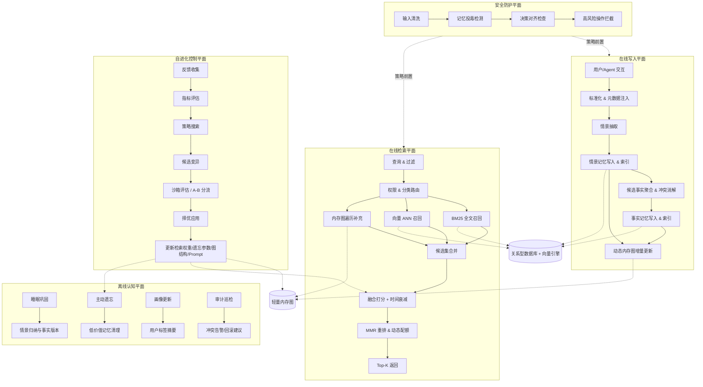
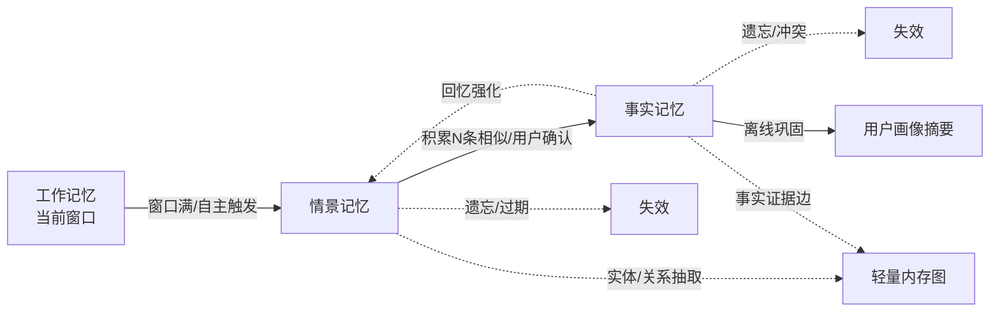
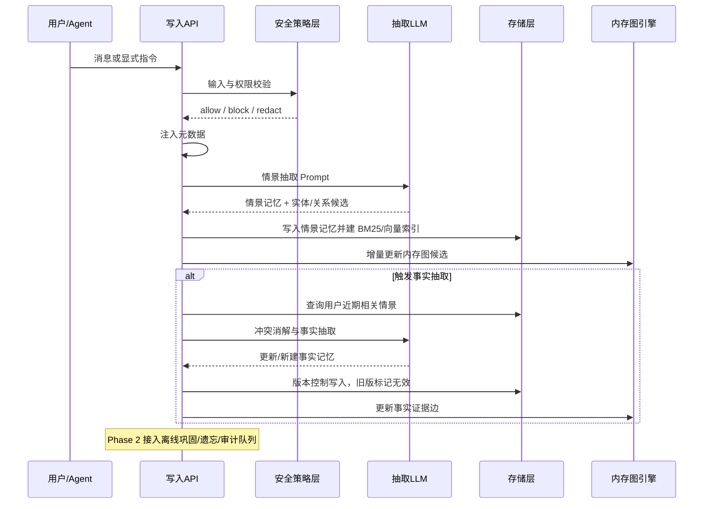
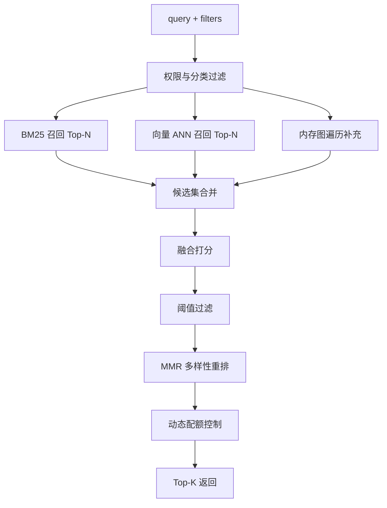
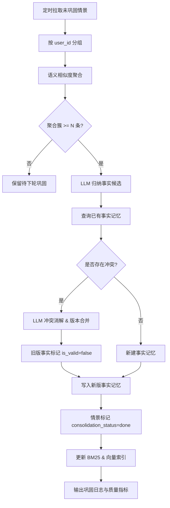
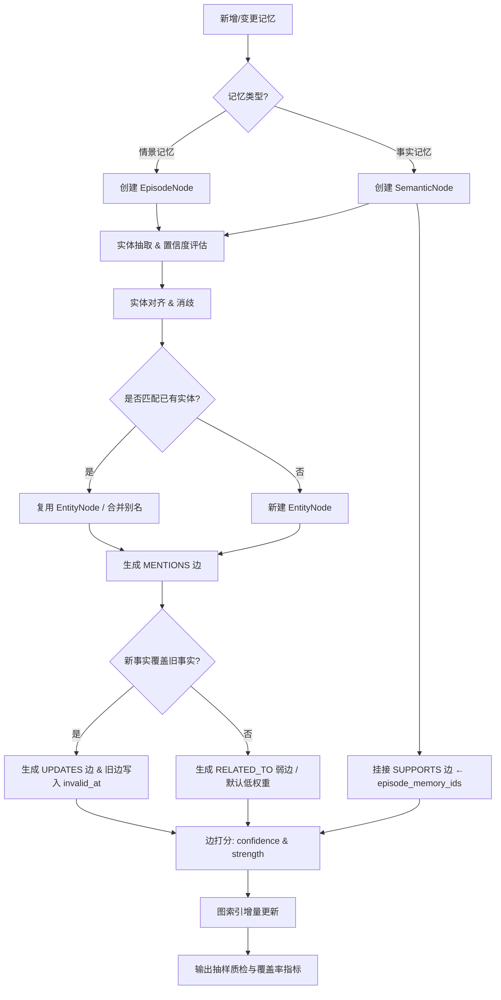
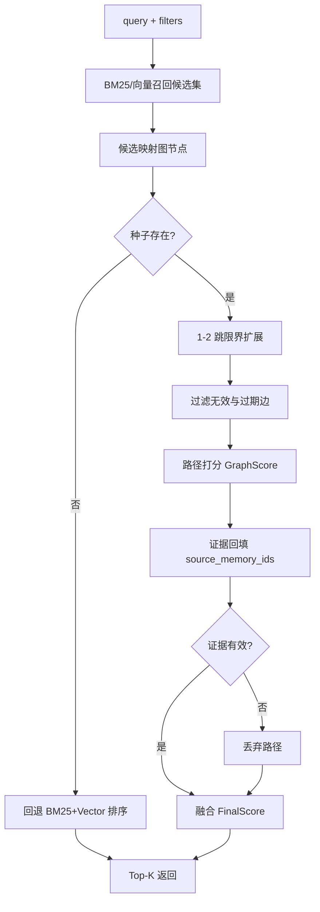
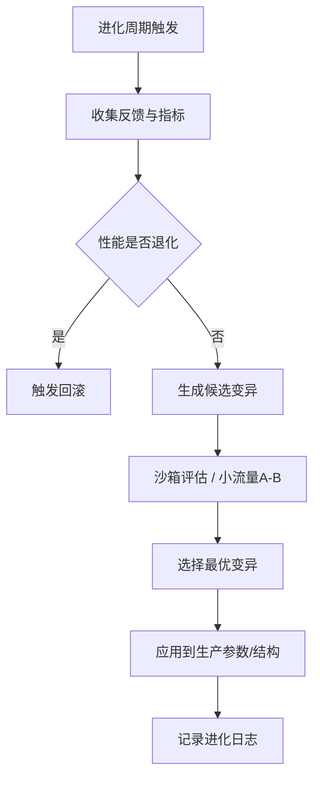

# Memory 系统方案设计 —— 自进化认知记忆架构-草稿（优化版）

## 1. 文档目标

设计一套可落地、高性价比、兼具前沿性的 AI Memory 系统。整体方案延续三层记忆、混合检索、轻量内存图、离线巩固、主动遗忘和自进化控制等设计，并补充“记忆代谢治理”和“安全防护平面”。

目标如下：

- 记忆按工作记忆、情景记忆、事实记忆三层管理，并引入记忆生命周期：抽取、巩固、遗忘、冲突消解、审计回滚。
- 检索采用 BM25 + 向量 + 时间感知 + 图补充的多路融合，辅以结构化字段过滤、多样性重排与动态配额。
- 不依赖持久化图数据库，以关系型数据库 + 向量数据库 + 轻量内存图实现“结构化画像 + 语义记忆 + 动态关系推理”的混合存储。
- 引入可控自进化能力：检索权重、遗忘参数、图结构、抽取策略、路由阈值根据反馈、离线评估和灰度结果持续优化。
- 阶段性落地，前期快速可用，后期逐步向 Agentic Memory、睡眠巩固、自进化认知架构演进。
- 在关键维度上对齐 Mem0、Zep、Letta、Memobase、Cognee 等主流开源框架，并保持对 LightMem、SCM、AriGraph、Associa、AgeMem 等前沿研究的持续吸收$^{[1][3][5][7][8][11][12][13]}$。

---

## 2. 设计理念与创新定位

### 2.1 开源框架的缺陷与本设计应对


| 框架名称                    | 现有缺陷                   | 对应创新设计                                  |
| ----------------------- | ---------------------- | --------------------------------------- |
| Mem0 $^{[1]}$           | 开源版本以向量/事实抽取为主，复杂关系推理与主动遗忘需业务补齐 | 轻量内存图 + 结构化字段；内置艾宾浩斯遗忘$^{[2]}$与主动修剪     |
| Zep $^{[3]}$            | 三层子图依赖图引擎体系，运维复杂度高     | 关系型 + 向量双库；图索引内存化并支持重建                  |
| Memobase $^{[4]}$       | 偏结构化画像，开放语义记忆弱         | 画像 + 情景 + 事实三态共存，支持开放语义沉淀               |
| Letta / MemGPT $^{[5]}$ | 强绑定运行时，自编辑存在误写风险       | Agent 提议-审核模式，限制直接覆盖事实源                 |
| Cognee $^{[6]}$         | 图流水线和参数体系维护成本高         | 模块化流水线，先可用后增强，渐进接入图能力                   |
| 普遍问题                    | 缺少“代谢式治理”（衰减、审计、回滚）    | 引入睡眠巩固$^{[7][8]}$、主动遗忘、审计回滚             |
|                         | 缺乏可评估的自优化闭环            | 自进化控制引擎：支持结构、参数、策略可控优化$^{[27][29][30]}$ |


### 2.2 与前沿研究全面对接


| 方向             | 代表工作                                       | 本设计实现                      |
| -------------- | ------------------------------------------ | -------------------------- |
| 时间感知与遗忘        | SuperLocalMemory$^{[9]}$、MemoTime$^{[10]}$ | 艾宾浩斯衰减 + 反馈强化的动态记忆强度       |
| 图结构记忆          | AriGraph$^{[11]}$、Associa$^{[12]}$         | 轻量内存图、证据子图、无持久化图 DB 的关系推理  |
| Agentic Memory | AgeMem$^{[13]}$、Memoria$^{[14]}$           | Agent 自主提议 + 审核，显式/隐式反馈强化  |
| 记忆基础设施         | SentenceKV$^{[15]}$、HiCache$^{[16]}$       | 淘汰策略与 KV 语义对齐，支持后续接入       |
| 高效检索           | IKE 二进制嵌入$^{[32]}$                         | 作为 Phase 3 可选加速层，降低检索延迟和内存 |
| 安全治理           | AgentWard$^{[33]}$                         | 读写前置防护、策略化拦截、审计日志与回滚       |


### 2.3 核心特色

1. **混合检索与记忆生命周期管理**：三路召回与动态记忆强度挂钩，支持代谢式更新。
2. **仿生遗忘机制与记忆巩固策略**：自适应遗忘曲线、离线睡眠加工、价值修剪与审计。
3. **多 Agent 原生可观测性架构**：字段化权限、来源、角色、会话和任务标识。
4. **内存驻留式轻量级记忆图谱**：在内存中维护关系索引，避免早期引入高运维图数据库。
5. **反馈驱动的自适应进化框架**：结构、参数、策略通过反馈和离线评估迭代。
6. **安全前置与可回滚**：在工具调用与记忆写入前执行策略校验，异常可回滚。

### 2.4 产品对外形态

- **Memory API 服务**：`/ingest`、`/retrieve`、`/feedback`、`/propose_memory`、`/audit`。  
- **Memory 管控台**：记忆浏览、证据追踪、冲突处理、策略灰度和指标看板。  
- **SDK 形态**：Python/TypeScript 双 SDK，支持多 Agent 与多租户。

### 2.5 总体架构




系统由**五个平面协同工作**：在线写入、在线检索、离线认知、自进化控制、安全防护。关系库与向量库是事实源，轻量内存图是可重建关系索引，安全平面负责策略前置和风险兜底。

---

## 3. 三层记忆模型与数据定义

### 3.1 模型转换




- 工作记忆（Working Memory）：源自 Baddeley 与 Hitch 模型$^{[31]}$，对应 LLM 上下文窗口，不持久化。  
- 情景记忆（Episodic Memory）：源自 Tulving 分类$^{[20]}$，存储带时间和情境的事件。  
- 事实记忆（Semantic Memory）：同源于 Tulving$^{[20]}$，表示可复用的去情境化事实与偏好。

### 3.2 工作记忆（Working Memory）

定义：当前对话窗口或最近几次交互上下文。

- 容量有限（受限于 Context Window），访问速度快，随对话结束可能丢失或压缩。  
- **作用**：维持任务连贯性，处理即时指代。

**当前最近 N 轮（默认 5 轮）数据已在 context 中处理。**

### 3.3 情景记忆结构（EpisodeMemory）

```python
@dataclass
class EpisodeMemory:
    id: str
    text: str
    adiu: str
    user_id: str
    session_id: str
    task_ids: list[str]
    agent_id: str
    agent_role: str
    timestamp: str
    is_valid: bool
    version: int
    source: str
    event_time: str
    event_type: str
    time_scope: str
    importance: int = 3
    context_window_id: str
    recall_count: int
    recall_time: str
    last_recalled_at: str | None = None
    is_update_to_Semantic: bool
    extra_json: dict[str, Any] = field(default_factory=dict)
    entities: list[dict] = field(default_factory=list)
    relations: list[dict] = field(default_factory=list)
    consolidation_status: str = "pending"
    risk_flags: list[str] = field(default_factory=list)   # 新增：投毒/越权/冲突风险标签
```

说明：

- `entities` 与 `relations` 保留动态构图线索，参考 Mem0 元数据与 AriGraph 情景-语义图$^{[1][11]}$。  
- `source`、`agent_id`、`session_id` 用于追溯来源和多 Agent 权限过滤。  
- `consolidation_status` 用于离线巩固队列。  
- `risk_flags` 用于安全平面与审计策略联动。

### 3.4 Mem0 情景记忆 prompt 分析：

- 可复用  
  - 七段式骨架（角色定义 → 类目 → Few-shot → 输出格式 → 补充规则 → 任务触发句）  
  - 空事件识别：`"Hi." -> {"facts":[]}` 可映射为 `{"episode":""}`  
  - 任务触发句与语言检测可直接迁移
- 不可复用  
  - 定位偏差：Mem0 偏“用户画像抽取”，与“情景轨迹摘要”目标不同  
  - Few-shot 需替换为业务高频场景  
  - 安全规则需改成“代码层拦截 + 日志审计”，不依赖单纯提示词

### 3.5 事实记忆结构（SemanticMemory）

```python
@dataclass
class SemanticMemory:
    id: str
    text: str
    adiu: str
    user_id: str
    session_ids: list[str]
    episode_memory_ids: list[str]
    agent_id: str
    agent_role: str
    visibility_scope: str
    timestamp: str
    score: float
    is_valid: bool
    version: int
    reinforce_count: int
    last_recalled_at: str | None = None
    extra_json: dict[str, Any] = field(default_factory=dict)
    importance: int = 3
    pinned: bool = False
    confidence: float = 0.8
    provenance_hash: str | None = None      # 新增：证据可追溯
```

说明：

- `episode_memory_ids` 是事实证据来源，也是图中 `SUPPORTS` 边依据。  
- `score` 用于艾宾浩斯遗忘曲线$^{[2]}$与反馈强化，受 SuperLocalMemory 启发$^{[9]}$。  
- `confidence` 表征事实可靠性，低置信候选默认不进入高优先召回。  
- `provenance_hash` 用于审计与回滚。

### 3.6 Mem0 事实记忆抽取 prompt：

- 可复用  
  - 角色定义 → 核心约束（首位）→ 类目 → Few-shot → 输出格式 → 核心约束重复（尾位）→ 任务触发句 的结构。
- 不可复用  
  - 原 7 类目偏通用个人信息，不适配高德导航业务  
  - Few-shot 需替换为真实业务语料  
  - 需支持 UPDATE/DELETE，不能仅 ADD  
  - 需新增“事实来源证明”和“冲突解释理由”输出字段

### 3.7 架构评审意见（关键修改项）

以下意见来自架构评审视角，已在后续章节落地：

1. **一致性与幂等未显式定义（高风险）**  
   - 问题：写入流程缺少 `request_id/event_id` 幂等键和重放策略。  
   - 风险：重试导致重复记忆、版本漂移。  
   - 修改：补充幂等键、乐观锁版本写入、失败补偿队列。

2. **SLO/SLA 与容量边界缺失（高风险）**  
   - 问题：没有明确延迟、可用性、召回准确阈值。  
   - 风险：上线后无法判断是否达标。  
   - 修改：新增性能目标与容量规划建议（P95、QPS、存储增速）。

3. **降级路径不完整（高风险）**  
   - 问题：图引擎或向量索引故障时的回退不够细。  
   - 风险：线上不可用或结果突变。  
   - 修改：定义三级降级（全量、半降级、纯 BM25 保底）和告警阈值。

4. **自进化缺少“停止条件”（中高风险）**  
   - 问题：只有择优应用，没有“止损停止”条件。  
   - 风险：策略震荡与线上回归。  
   - 修改：新增变更冻结窗口、连续失败熔断、自动回滚条件。

5. **数据治理边界不足（中风险）**  
   - 问题：PII 分类、保留周期、删除 SLA 未量化。  
   - 风险：合规风险与审计困难。  
   - 修改：新增数据分级、保留策略、可追溯删除流程。

---

## 4. 写入流程（Ingest）




关键说明：

- 抽取 Prompt 运用首因/近因效应$^{[21]}$和 Few-shot 反例设计$^{[1]}$。  
- 冲突消解采用版本化 + LLM 决策，参考 Mem0 策略$^{[1]}$并增强为 UPDATE/DELETE。  
- Agent 自主提议通过 `propose_memory` 实现，灵感来自 AgeMem$^{[13]}$，并以审核机制保证可靠性。  
- 写入前增加安全策略层，降低记忆投毒和越权写入风险$^{[33]}$。

### 4.1 工程性补充：幂等、一致性与补偿

- **幂等键**：每次写入必须携带 `request_id` 与 `event_id`，以 `(user_id, event_id)` 作为唯一键。  
- **版本控制**：事实写入采用乐观锁 `version`，冲突时走重试 + 冲突队列，不允许静默覆盖。  
- **补偿机制**：图更新失败时进入 `graph_rebuild_queue`，由异步任务按 `source_memory_ids` 重建。  
- **可追踪性**：写入日志包含 `trace_id`，串联 API、LLM、DB、MG 四段链路。

### 4.2 性能目标（SLO）与容量基线

- **在线检索**：P95 < 300ms（不含 LLM 生成）；P99 < 600ms。  
- **写入链路**：P95 < 500ms（含抽取与索引）；失败重试不超过 2 次。  
- **可用性**：检索服务月度可用性 >= 99.9%。  
- **容量建议**：单租户日增 10 万条情景记忆时，向量索引与 BM25 索引需支持在线分片扩容。  
- **报警阈值**：`negative_feedback_rate` 连续 3 个窗口上升 > 20% 触发策略冻结。

---

## 5. 检索流程（多路融合 + 时间感知）




### 5.1 融合打分公式

$FinalScore_i = w_v * VecSim_i + w_k * BM25Norm_i + w_t * TimeDecay_i + w_{imp} * Imp_i + w_g * GraphScore_i$

- BM25：经典文本排序函数$^{[22]}$，对 `text` 字段打分。  
- 向量相似度：余弦相似度归一化到 `[0,1]`，由 ANN 引擎（如 Qdrant）提供$^{[23]}$。  
- 时间衰减：采用艾宾浩斯指数衰减$^{[2][9]}$。  
- 重要性因子：`Imp_i = min(1, reinforce_count/5)`。  
- 图分：`GraphScore_i` 来自路径强度与证据覆盖（第 7 章详述），并建议先归一化到 `[0,1]` 以避免单通道主导。  
- 默认权重：`w_v=0.45, w_k=0.30, w_t=0.10, w_imp=0.05, w_g=0.10`，后续由自进化控制引擎调优。

### 5.2 记忆强度更新

$S_i \leftarrow clamp(S_{\min}, S_{\max}, (1-\gamma)S_i + \lambda_{pos} \cdot pos\_fb - \lambda_{neg} \cdot neg\_fb)$  
$TimeDecay_i = exp(-\Delta t / S_i)$

初始 `S_i(0)=1`，建议 `S_min=0.5, S_max=10`；默认 `\gamma=0.05, \lambda_{pos}=0.5, \lambda_{neg}=0.7`。这样可同时处理强化与负反馈，避免强度无界增长导致“永不遗忘”。

### 5.3 多样性重排（MMR）

$MMR_i = \lambda * sim(content_i, q) - (1-\lambda) * \max_j sim(content_i, content_j)$

MMR 来自 Carbonell 与 Goldstein$^{[25]}$，用于去重和多样性增强，默认 `lambda=0.7`。

### 5.4 过滤策略

- 阈值过滤：默认低于 `0.55` 不进入最终候选，参考 RAG 过滤实践$^{[26]}$。  
- 动态配额：时间词偏向情景记忆，偏好词偏向事实记忆。  
- 权限过滤：按 `user_id`、`agent_id`、`visibility_scope`、`is_valid` 过滤。  
- 风险过滤：命中 `risk_flags` 的记忆需降权或进入人工审核通道。

### 5.5 降级与回退策略（新增）

- **Level-0（正常）**：BM25 + Vector + Graph 全链路。  
- **Level-1（图降级）**：Graph 不可用时，`w_g=0`，保留 BM25 + Vector。  
- **Level-2（向量降级）**：向量不可用时，启用 BM25 + 规则召回 + 最近有效事实缓存。  
- **Level-3（保底）**：仅 BM25 + `pinned facts`，保障关键事实可达。  
- **一致性要求**：降级不得绕过权限过滤与安全策略层。

---

## 6. 离线认知平面（Phase 2）

### 6.1 睡眠巩固

设计来源：SCM 的 NREM/REM 双阶段巩固$^{[7]}$与 LightMem 的 sleep-time 更新$^{[8]}$。

流程：




目标：

- 减少重复情景。  
- 沉淀稳定事实。  
- 降低检索上下文冗余。

### 6.2 主动遗忘

$ForgetScore = 0.7*(1-TimeDecay) + 0.3*(1-Imp)$

- `TimeDecay` 表示时间衰减$^{[2][9]}$。  
- `Imp` 综合重要性、召回次数、反馈和引用关系$^{[7]}$。  
- 高忘记分先进入候选归档或候选失效，不直接物理删除。

### 6.3 反馈闭环

- 显式反馈：点赞、纠错、删除、确认事实，直接更新强度和有效位$^{[1][3]}$。  
- 隐式反馈：被继续追问、未被纠错、被任务引用，可轻度强化，参考 Memoria$^{[14]}$。  
- 所有反馈策略上线前需离线评估 + 小流量验证。

### 6.4 Agent 自主提议

- Agent 可通过 `propose_memory` 提交候选与置信度，灵感来自 AgeMem$^{[13]}$。  
- 低置信候选进入审核队列，不直接写入事实源。  
- 审核结合规则、LLM 校验和抽样质检。

### 6.5 离线评测基线（新增）

- 记忆质量：Precision@k、Recall@k、冲突率、事实漂移率。  
- 业务指标：topk_ctr、follow_up_rate、negative_feedback_rate。  
- 成本指标：token/请求、P95 延迟、存储增长率。  
- 基准建议：LoCoMo$^{[17]}$、LongMemEval$^{[18]}$ + 业务私有评测集。

### 6.6 数据治理与合规策略（新增）

- **数据分级**：将记忆分为 `public / internal / sensitive`，敏感记忆默认不参与跨 Agent 共享。  
- **保留周期**：情景记忆默认 90 天滚动保留；事实记忆按“仍被证据支持”规则续期。  
- **删除 SLA**：用户删除请求在 24 小时内完成逻辑删除，72 小时内完成索引与备份清理。  
- **审计要求**：所有删除、回滚、策略变更均写审计日志，含 `operator_id`、`trace_id` 与变更前后摘要。  

---

## 7. 自进化认知记忆架构（Phase 3）

### 7.1 设计目标

Phase 3 目标是实现系统级自优化，覆盖检索权重、遗忘参数、图结构与抽取模板，思路来自 Agent 记忆研究、AutoML 和进化算法$^{[13][27][29]}$。

自进化不是无约束自动修改，而是：

- 有评估集。  
- 有候选策略。  
- 有沙箱评估。  
- 有小流量 A/B。  
- 有回滚机制。

### 7.2 动态内存图实现方案

动态内存图保留“双层图（实体层 + 记忆层）”并细化为四类节点、六类边和轻量索引接口。

#### 7.2.1 设计来源

- AriGraph：情景与语义融合成图$^{[11]}$。  
- Associa：证据子图检索与审慎回忆$^{[12]}$。  
- PersonalAI：图存储/检索复杂度控制$^{[28]}$。  
- MemoTime：时序关系与动态失效边$^{[10]}$。

#### 7.2.2 图节点


| 节点              | 来源   | 用途            |
| --------------- | ---- | ------------- |
| `EpisodeNode`   | 情景记忆 | 事件、时间、会话、来源   |
| `SemanticNode`  | 事实记忆 | 稳定事实、偏好、计划    |
| `EntityNode`    | 实体抽取 | 人、地点、组织、路线、对象 |
| `CommunityNode` | 离线聚类 | 稳定主题簇/长期社区    |


#### 7.2.3 图边


| 边类型          | 含义        | 主要来源                 |
| ------------ | --------- | -------------------- |
| `MENTIONS`   | 情景/事实提及实体 | 实体抽取                 |
| `SUPPORTS`   | 情景支持某条事实  | `episode_memory_ids` |
| `CONFLICTS`  | 事实/事件冲突   | 冲突消解                 |
| `UPDATES`    | 新事实更新旧事实  | 版本控制                 |
| `RELATED_TO` | 弱关联       | 共现、相似度、规则            |
| `BELONGS_TO` | 节点归属社区    | 离线聚类                 |


#### 7.2.4 数据结构

```python
@dataclass
class GraphNode:
    id: str
    node_type: str
    label: str
    user_id: str
    memory_id: str | None = None
    created_at: str | None = None
    updated_at: str | None = None
    is_valid: bool = True
    extra_json: dict = field(default_factory=dict)

@dataclass
class GraphEdge:
    id: str
    edge_type: str
    source_node_id: str
    target_node_id: str
    confidence: float
    strength: float
    source_memory_ids: list[str]
    valid_at: str | None = None
    invalid_at: str | None = None
    last_accessed_at: str | None = None
    is_valid: bool = True
    extra_json: dict = field(default_factory=dict)

@dataclass
class MemoryGraphIndex:
    user_id: str
    nodes: dict[str, GraphNode]
    edges: dict[str, GraphEdge]
    adjacency: dict[str, list[str]]
    built_at: str
    version: int
```

字段约束：

- `source_memory_ids` 必须存在，否则边不进入线上检索上下文。  
- `confidence` 表示抽取可信度。  
- `strength` 表示边强度，可被强化和衰减调整。  
- `valid_at/invalid_at` 表示关系有效期。

#### 7.2.5 构图流程




关键规则：

- 情景记忆优先生成 `EpisodeNode` + `MENTIONS`。  
- 事实记忆优先生成 `SemanticNode` + `SUPPORTS`。  
- 覆盖旧事实时新增 `UPDATES`，并为旧边写 `invalid_at`。  
- `RELATED_TO` 为弱边，不作为强事实依据。

#### 7.2.6 图检索流程




图路径打分建议：

$GraphScore = PathStrength * EvidenceCoverage * TimeValidity / (1 + hop_count)$

其中 `PathStrength` 为路径边强度均值，`EvidenceCoverage` 要求可回填证据，`hop_count` 控制噪声。

#### 7.2.7 图维护策略


| 操作   | 触发        | 处理                 |
| ---- | --------- | ------------------ |
| 边强化  | 图路径被答案使用  | 提升 `strength`      |
| 边衰减  | 长期未访问/低置信 | 降低 `strength`      |
| 边失效  | 新事实更新旧事实  | 写入 `invalid_at`    |
| 实体合并 | 高置信别名冲突   | 合并节点并保留映射          |
| 社区摘要 | 稳定主题簇形成   | 生成 `CommunityNode` |
| 图修剪  | 低强度且无证据   | 候选删除或冷区归档          |


### 7.3 自进化控制引擎




进化维度（含上线守护栏）：

- 检索权重：贝叶斯优化或网格搜索，参考 SuperLocalMemory$^{[9]}$。  
- 遗忘参数：A/B 优化 `lambda`、`theta`，参考 SCM$^{[7]}$。  
- 图结构演化：边增删、衰减、剪枝阈值，受进化算法启发$^{[29]}$。  
- 抽取 Prompt 优化：引入 DSPy 离线搜索模板$^{[30]}$。  
- **守护栏**：候选策略必须满足 `quality >= baseline - ε`、`safety 不下降`、`P95 延迟涨幅 <= δ` 才可进入灰度。

### 7.3.1 变更控制与停止条件（新增）

- **连续失败熔断**：同一策略在连续 2 个灰度窗口不达标，自动停止并回滚。  
- **冻结窗口**：高峰时段禁止策略自动切换，仅允许人工审批。  
- **回滚触发**：`negative_feedback_rate`、`safety_block_rate`、`P95 latency` 任一超阈值立即回滚。  
- **审计留痕**：每次策略变更记录“原因-指标-结果-回滚点”四元组。

### 7.3.2 评审验收清单（新增）

上线前必须满足：

1. 离线评估集上质量指标不低于基线；  
2. 小流量灰度满足时延与安全阈值；  
3. 数据治理规则（保留/删除/脱敏）通过审计；  
4. 降级演练通过（至少一次 Level-2 与 Level-3 演练）；  
5. 回滚脚本可在 5 分钟内恢复至上一稳定版本。

### 7.4 与前沿对接


| 前沿工作                     | 本方案体现         | 边界               |
| ------------------------ | ------------- | ---------------- |
| AriGraph$^{[11]}$        | 情景-语义融合图、边权动态 | 不照搬探索环境设定        |
| Associa$^{[12]}$         | 证据子图、关联扩展     | 不直接实现复杂 PCST     |
| AgeMem$^{[13]}$          | Agent 记忆提议    | 必须审核，不直写事实源      |
| SCM$^{[7]}$              | 价值遗忘与睡眠巩固     | 参数需离线验证          |
| SuperLocalMemory$^{[9]}$ | 检索通道和遗忘参数搜索   | 不做无评估自动调参        |
| DSPy$^{[30]}$            | 抽取 Prompt 搜索  | 仅离线评估集迭代         |
| AgentWard$^{[33]}$       | 读写前置防护与回滚     | 不把策略放进可篡改 Prompt |


### 7.5 图（Memory Graph）完整示例：通勤偏好与动态路况关联

**场景背景**：用户 `user001` 在工作日高峰有固定通勤习惯，且对特定路段拥堵敏感。系统需将用户偏好、常去地点与实时路况关联。

#### 1. Memory 输入与抽取（Input & Extraction）

- **情景 1（T1）**：用户说“还是走机场高速吧，虽然远点但比较稳。”  
  - 抽取：`ep_001` + `ent_route_airport` + `ent_home` + `ent_office`
- **情景 2（T2）**：用户说“今天中河高架堵死了，帮我切回机场高速。”  
  - 抽取：`ep_002` + `ent_route_zhonghe`
- **事实巩固（T3）**：离线归纳  
  - `lt_001`: “早高峰偏好机场高速，规避中河高架拥堵”

#### 2. 图结构生成与增量更新（Graph Generation & Update）

- 节点：`EpisodeNode(ep_001, ep_002)`、`SemanticNode(lt_001)`、`EntityNode(...)`  
- 边：  
  - `MENTIONS`: `ep_001 -> ent_route_airport`、`ep_002 -> ent_route_zhonghe`  
  - `SUPPORTS`: `ep_001 -> lt_001`、`ep_002 -> lt_001`  
  - `RELATED_TO`: `ent_home -> ent_office (Commute)`

#### 3. 图增强检索流程（Graph-Augmented Retrieval）

- 查询：“明天早上怎么去公司？”  
- 检索：种子识别 `ent_user`/`ent_office` → 反向命中 `lt_001` → 证据情景 `ep_001/ep_002` → 路径打分上升。  
- 输出：首选机场高速，并给出“基于历史高峰稳定偏好”的证据解释。

### 7.6 自进化（Self-Evolution）完整示例：避堵策略动态优化

**场景背景**：系统发现雨天场景下用户更偏好“稳妥路线”而非“最短时间”路线。

#### 1. 反馈收集与指标监控（Feedback & Monitoring）

- 隐式反馈：雨天多次放弃“最快路线”，转选主干道。  
- 显式反馈：点击“不实用”。  
- 指标：`topk_ctr` 在雨天子场景下降，`negative_feedback_rate` 上升。

#### 2. 进化策略生成与变异（Strategy Mutation）

1. 重要性因子改造：
  `Imp_i = min(1, (reinforce_count + RecentFeedbackBoost_i)/5)`
2. 时效窗口：`RecentFeedbackBoost_i` 只统计近 7 天。
3. 生效范围：仅作用于 `weather/traffic_event` 标签请求。

#### 3. 沙箱评估与灰度发布（Evaluation & Deployment）

- 离线评估集：雨天导航历史 500 条；路线采纳率提升。  
- A/B：5% 流量灰度，24h 观察负反馈下降。  
- 全量：通过阈值后全量推送，并记录进化日志。

#### 4. 优化后的检索表现（Optimized Retrieval）

- 查询（雨天）：“去西湖银泰。”  
- 优化后流程：识别雨天标签 → 提升“规避积水支路”相关记忆权重 → 图谱补充路段风险 → 返回“主干道更稳妥”方案并给出可解释说明。

---

## 8. 对比开源框架的优越性总结


| 维度      | Mem0$^{[1]}$ | Zep$^{[3]}$ | Memobase$^{[4]}$ | Letta$^{[5]}$ | Cognee$^{[6]}$ | 本方案                |
| ------- | ------------ | ----------- | ---------------- | ------------- | -------------- | ------------------ |
| 存储      | 向量 + 元数据     | 时序图 + PG    | 结构化 SQL          | 多后端           | 向量 + 图 DB      | 关系型 + 向量 + 轻量内存图   |
| 遗忘      | 弱            | 边失效         | 弱                | 弱             | 弱              | 艾宾浩斯 + 主动修剪 + 边衰减  |
| 检索      | 语义为主         | 图增强         | 字段匹配             | 多路并行          | 混合向量-图         | BM25 + 向量 + 图 + 时间 |
| 自主性     | 被动 API       | 被动          | 被动               | 高自主但风险高       | 流水线            | 提议-审核 + 可控演化       |
| 自进化     | 弱            | 弱           | 弱                | 弱             | 弱              | 参数-结构-Prompt 可评估优化 |
| 安全治理    | 基础           | 中           | 基础               | 中             | 中              | 五平面前置防护 + 回滚       |
| 运维      | 低            | 高           | 低                | 中高            | 中高             | 中低，渐进复杂度           |
| 多 Agent | 受限           | 有限          | 同步               | 运行时绑定         | 有限             | 字段化可见性 + 策略隔离      |

### 8.1 架构评审结论（新增）

综合评审意见，本方案的主要优势在于“可渐进落地 + 可治理演进”。需要持续关注三点：

- **第一优先级**：SLO 与降级策略必须先于策略进化上线；  
- **第二优先级**：保证证据链完整（`source_memory_ids` + `provenance_hash`）；  
- **第三优先级**：自进化只能在守护栏内运行，禁止无评估自动发布。


---

## 9. 结论

本设计以分层记忆、混合检索、自主生命周期为基础，以零持久化图数据库的工程哲学实现可演进 AI Memory 架构，并按三阶段逐步迭代：

- Phase 1：保证三层记忆与 BM25 + 向量检索快速可用，并引入主动遗忘；  
- Phase 2：引入睡眠巩固、反馈闭环与离线评测；  
- Phase 3：通过轻量内存图与自进化控制增强跨 Session 串联、事实演化、关系推理和证据解释，并接入安全防护与可回滚机制。

整体目标是构建“可长期运行、可解释、可治理、可自优化”的 Memory 基础设施。

补充建议：实施顺序应优先“稳定性与治理”再“复杂智能”。即先完成幂等一致性、降级回退、审计可追溯，再逐步扩大图推理与自进化范围。

---

## 10. 参考文献

[1] Mem0: Building Production-Ready AI Agents with Scalable Long-Term Memory. arXiv:2504.19413, 2025.  
[2] Ebbinghaus, H. (1885). Memory: A Contribution to Experimental Psychology.  
[3] Zep: A Temporal Knowledge Graph Architecture for Agent Memory. arXiv:2501.13956, 2025.  
[4] Memobase: 超越RAG——为AI应用注入长期记忆. InfoQ, 2025.  
[5] Packer, C., et al. MemGPT: Towards LLMs as Operating Systems. arXiv:2310.08560.  
[6] Cognee: Build faster AI memory with Cognee & Redis. Redis Blog, 2025.  
[7] Shinde, S. SCM: Sleep-Consolidated Memory with Algorithmic Forgetting for LLMs. arXiv:2604.20943.  
[8] Fang, J., et al. LightMem: Lightweight and Efficient Memory-Augmented Generation. arXiv:2510.18866.  
[9] SuperLocalMemory V3.3: The Living Brain. Zenodo, 2026.  
[10] MemoTime: Memory-Augmented Temporal Knowledge Graph Framework.  
[11] Anokhin, P., et al. AriGraph: Learning Knowledge Graph World Models with Episodic Memory for LLM Agents. IJCAI 2025.  
[12] Zhang, Y., Yuan, W., Jiang, Z. Bridging Intuitive Associations and Deliberate Recall with Graph-Structured Long-term Memory. ACL 2025 Findings.  
[13] Agentic Memory: Learning Unified Long-Term and Short-Term Memory Management for LLM Agents. ACL 2026.  
[14] Sarin, S., et al. Memoria: A Scalable Agentic Memory Framework for Personalized Conversational AI. arXiv:2512.12686.  
[15] Zhu, Y., et al. SentenceKV: Efficient LLM Inference via Sentence-Level Semantic KV Caching. arXiv:2504.00970.  
[16] 阿里云. 阿里云 Tair 联手 SGLang 共建 HiCache. 2025.  
[17] Maharana, et al. Evaluating Very Long-Term Conversational Memory of LLM Agents. ACL 2024.  
[18] Wu D, Wang H, et al. LongMemEval: Benchmarking chat assistants on long-term interactive memory. arXiv:2410.10813.  
[19] Atkinson, R.C. & Shiffrin, R.M. Human memory: A proposed system and its control processes. 1968.  
[20] Tulving, E. Episodic and semantic memory. 1972.  
[21] Murdock, B.B. The serial position effect of free recall. 1962.  
[22] Robertson, S.E. & Zaragoza, H. BM25 and Beyond. 2009.  
[23] Qdrant Vector Database. [https://qdrant.tech/](https://qdrant.tech/)  
[24] OpenClaw: 基于 Hologres + Mem0 实现长记忆增强. 阿里云, 2026.  
[25] Carbonell, J. & Goldstein, J. The use of MMR for reordering documents. SIGIR 1998.  
[26] Lewis, P., et al. Retrieval-Augmented Generation for Knowledge-Intensive NLP Tasks. NeurIPS 2020.  
[27] AutoML 与进化算法在 LLM 中的应用：多篇文献综述。  
[28] PersonalAI: A Systematic Comparison of Knowledge Graph Storage and Retrieval for Personalized LLM agents. arXiv:2506.17001.  
[29] Bäck, T. Evolutionary Algorithms in Theory and Practice. 1996.  
[30] Khattab, O., et al. DSPy: Compiling Declarative Language Model Calls into Self-Improving Pipelines. arXiv:2310.03714.  
[31] Baddeley, A.D., & Hitch, G. Working memory. 1974.  
[32] LLMs Meet Isolation Kernel: Lightweight, Learning-free Binary Embeddings for Fast Retrieval. arXiv:2601.09159.  
[33] AgentWard: A Full-Stack Lifecycle Security Architecture for Autonomous AI Agents. FIND-Lab, 2026.