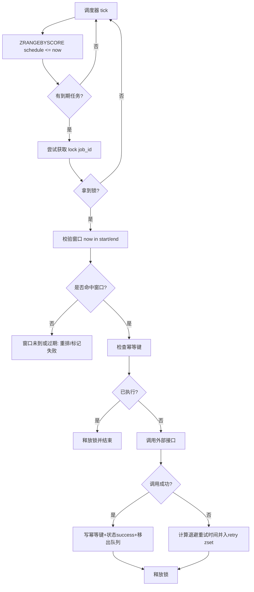

# 基于 Redis 的时间窗口触发外部接口方案

## 1. 目标

设计一套基于 Redis 的时间窗口触发机制：当到达指定时间窗口时，自动触发外部接口调用，并保证高可用、可重试、可观测、避免重复触发。

---

## 2. 适用场景

- 定时营销推送（如每天 10:00-10:05 触发一次）
- 账单结算窗口触发
- 周期任务到点调用第三方回调接口
- SLA 监控超时窗口触发告警接口

---

## 3. 核心设计思路

采用 Redis `ZSET + 分布式锁 + 幂等键 + 重试队列` 组合：

1. `ZSET` 存储待触发任务，score 为触发时间戳（毫秒）。
2. 调度器轮询 `score <= now` 的任务。
3. 抢占分布式锁，确保同一任务只被一个实例执行。
4. 调用外部接口前写入幂等标记，避免重复调用。
5. 调用失败进入重试队列（带退避策略）。
6. 成功后更新状态并写审计日志。

---

## 4. Redis Key 设计

### 4.1 主任务队列（按触发时间排序）

- Key: `tw:job:schedule:zset`
- Type: `ZSET`
- Member: `job_id`
- Score: `trigger_at_ms`

### 4.2 任务详情

- Key: `tw:job:meta:{job_id}`
- Type: `HASH`
- 字段建议：
  - `job_id`
  - `window_start_ms`
  - `window_end_ms`
  - `callback_url`
  - `payload_json`
  - `status`（pending/running/success/failed/dead）
  - `retry_count`
  - `next_retry_at_ms`
  - `updated_at_ms`

### 4.3 执行锁

- Key: `tw:job:lock:{job_id}`
- Type: `STRING`
- Value: `worker_id`
- 使用 `SET lock_key worker_id NX PX 30000`

### 4.4 幂等键

- Key: `tw:job:idem:{job_id}:{window_start_ms}`
- Type: `STRING`
- Value: `done`
- TTL: 建议 7 天（按业务可调）

### 4.5 重试队列

- Key: `tw:job:retry:zset`
- Type: `ZSET`
- Member: `job_id`
- Score: `next_retry_at_ms`

---

## 5. 触发流程



---

## 6. 关键实现细节

### 6.1 时间窗口语义

- `window_start_ms <= now <= window_end_ms` 视为可触发。
- 若 `now < window_start_ms`：说明任务提早被扫描，重新放回调度队列。
- 若 `now > window_end_ms`：标记 `failed_timeout`，可选触发告警。

### 6.2 一致性策略

- 至少一次（At-Least-Once）触发语义 + 业务幂等。
- 通过幂等键实现“逻辑上仅一次（effectively-once）”。
- 外部接口建议携带 `Idempotency-Key: job_id + window_start_ms`。

### 6.3 重试退避策略

建议指数退避：

- `delay = min(base * 2^retry_count, max_delay)`
- 示例：`base=5s, max_delay=10min, max_retry=8`

超过最大重试后：

- 状态置为 `dead`
- 入死信列表 `tw:job:dead:list`
- 触发告警（短信/IM/邮件）

### 6.4 防重复扫描优化

单次只拉取小批量（如 100 条）：

- `ZRANGEBYSCORE tw:job:schedule:zset -inf now LIMIT 0 100`

并发 worker 场景下依靠分布式锁去重。

### 6.5 锁释放安全

使用 Lua 脚本“比对 value 后删除”防止误删他人锁：

```lua
if redis.call("GET", KEYS[1]) == ARGV[1] then
  return redis.call("DEL", KEYS[1])
else
  return 0
end
```

---

## 7. 伪代码（Python 风格）

```python
def scheduler_tick(now_ms: int, worker_id: str):
    job_ids = redis.zrangebyscore("tw:job:schedule:zset", 0, now_ms, start=0, num=100)
    for job_id in job_ids:
        lock_key = f"tw:job:lock:{job_id}"
        locked = redis.set(lock_key, worker_id, nx=True, px=30000)
        if not locked:
            continue
        try:
            meta = redis.hgetall(f"tw:job:meta:{job_id}")
            ws, we = int(meta["window_start_ms"]), int(meta["window_end_ms"])
            if now_ms < ws:
                continue
            if now_ms > we:
                mark_timeout(job_id, now_ms)
                redis.zrem("tw:job:schedule:zset", job_id)
                continue

            idem_key = f"tw:job:idem:{job_id}:{ws}"
            if redis.exists(idem_key):
                redis.zrem("tw:job:schedule:zset", job_id)
                continue

            ok = call_external_api(meta["callback_url"], meta["payload_json"], idem_key)
            if ok:
                redis.setex(idem_key, 7 * 24 * 3600, "done")
                mark_success(job_id, now_ms)
                redis.zrem("tw:job:schedule:zset", job_id)
            else:
                retry_count = int(meta.get("retry_count", 0)) + 1
                if retry_count > 8:
                    mark_dead(job_id, now_ms)
                    redis.zrem("tw:job:schedule:zset", job_id)
                else:
                    delay_ms = min(5000 * (2 ** (retry_count - 1)), 10 * 60 * 1000)
                    next_retry = now_ms + delay_ms
                    redis.hset(f"tw:job:meta:{job_id}", mapping={
                        "retry_count": retry_count,
                        "next_retry_at_ms": next_retry,
                        "status": "failed",
                        "updated_at_ms": now_ms,
                    })
                    redis.zadd("tw:job:retry:zset", {job_id: next_retry})
                    redis.zrem("tw:job:schedule:zset", job_id)
        finally:
            safe_unlock(lock_key, worker_id)
```

---

## 8. 运维与监控指标

建议接入以下指标：

- `trigger_due_count`：到期任务数
- `trigger_success_count`：触发成功数
- `trigger_fail_count`：触发失败数
- `trigger_retry_count`：重试次数
- `trigger_lag_ms_p95`：触发延迟 P95
- `dead_letter_count`：死信数
- `duplicate_block_count`：幂等拦截次数

告警建议：

- 死信数突增
- 触发延迟超过窗口阈值
- 外部接口连续失败率 > 设定阈值

---

## 9. 落地建议（从简到全）

### Phase 1（快速可用）

- ZSET 调度 + 分布式锁 + 幂等键 + 基础重试

### Phase 2（稳定性增强）

- 死信队列 + 告警 + 指标看板 + 退避策略优化

### Phase 3（高阶能力）

- 多租户隔离（key 前缀 namespace）
- 动态窗口策略（按业务优先级）
- Lua/事务脚本实现原子状态流转
- 与 MQ 联动（Redis 负责时间触发，MQ 负责高吞吐执行）

---

## 10. 总结

本方案以 Redis 为核心实现“时间窗口触发外部接口”，重点解决了到点触发、并发去重、失败重试和可观测性问题。工程上可先以 ZSET 调度模型快速上线，再逐步升级为带死信、告警和多租户治理的生产级触发系统。
